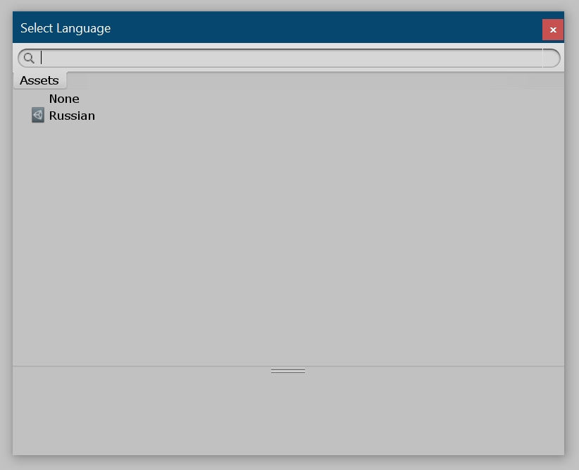
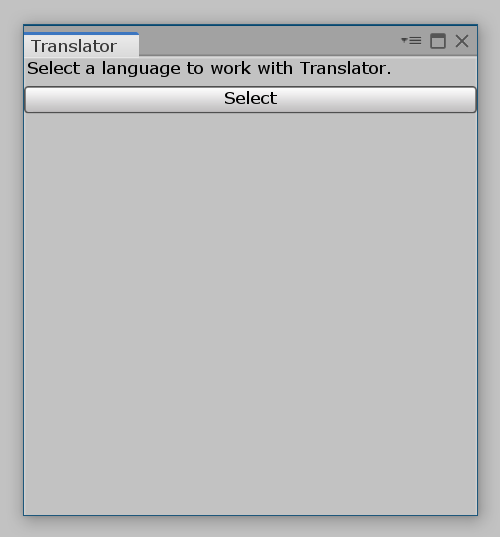
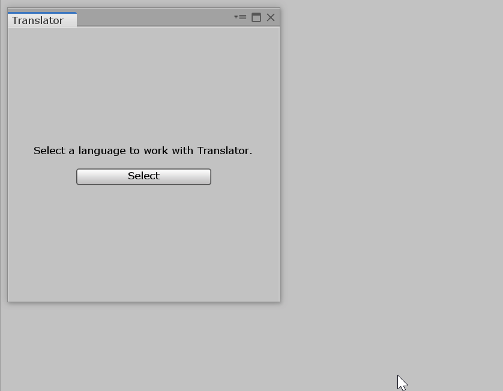
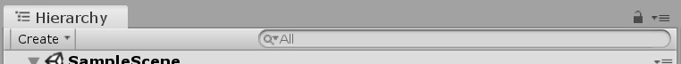
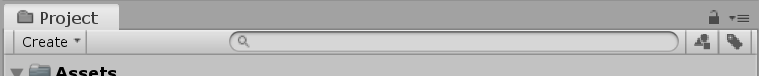
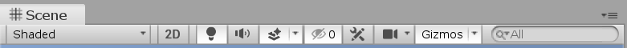
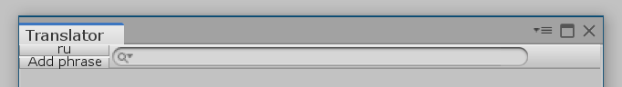
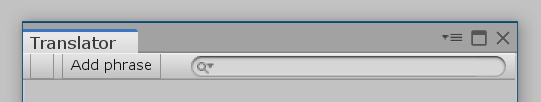
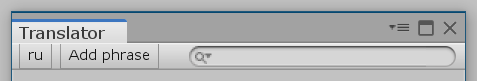
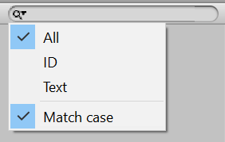

# Редактор языка. Основа

Пришло время создать ключевой элемент всего пакета — редактор языка, который будет называться "Translator". Материала так много, что создавать редактор мы будем на протяжении трех статей. В этой части мы создадим основной интерфейс редактора.

## Окно

В папке `Scripts/Editor` создадим класс `Translator`:

```csharp
using UnityEngine;
using UnityEditor;
using UnityEngine.UIElements;

namespace I18n.EditorUtilities
{
    public class Translator : EditorWindow
    {
        Language lang;

        VisualElement Root => rootVisualElement;

        [MenuItem("Window/Translator")]
        public static Translator ShowWindow()
        {
            var window = GetWindow<Translator>();
            window.titleContent = new GUIContent("Translator");
            window.minSize = new Vector2(300, 300);
            window.Show();

            return window;
        }

        void OnEnable()
        {

        }
    }
}
```

Это обычный код окна редактора Unity. Стоит упомянуть переменную `lang`, которая хранит язык, который в данный момент открыт в редактора, а также свойство `Root`, которое является удобным сокращением переменной `rootVisualElement`.

```csharp
Language lang;

VisualElement Root => rootVisualElement;
```

Помимо этого, установлен минимальный размер окна редактора: 300 пикселей в высоту и ширину.

```csharp
window.minSize = new Vector2(300, 300);
```

## Выбор языка

Сейчас переменная `lang` нашего окна всегда равна `null`, так как мы ничего в не помещаем. Пора это исправить!

Для начала создадим публичное свойство `Lang` прямо под переменной `lang` для получения и установки языка. Зачем свойство? Потому что при смене языка нам придется обновлять интерфейс редактора. И только одна из причин. О другой ниже.

```csharp
public Language Lang
{
    get => lang;

    set
    {
        lang = value;

        if (lang != null)
            EditorUtility.SetDirty(lang);

        SetupLayout();
    }
}
```

Что за `SetDirty(lang)`? А это еще одна причина, из-за который мы создали свойство `Lang`. Этим вызовом мы говорим Unity, чтобы он действительно записывал изменения в языке. Без вызова `SetDirty` все изменения будут потеряны после перезапуска Unity.

Теперь нам нужен метод, который открывает окно, в котором можно выбрать нужный язык. Назовем его `OpenLangPicker`:

```csharp
void OpenLangPicker(Language langToShow = null)
{
    EditorGUIUtility.ShowObjectPicker<Language>(langToShow, false, "", 0);
}
```

Метод принимает необязательный аргумент `langToShow`. Если его указать, то в окне выбора указанный язык будет выделен по умолчанию.

Вот так будет выглядеть окно выбора языка:

[{: .w7 }](images/lang-picker-window.png)

Но открыть окно выбора — полдела. Нам нужно отловить момент, когда пользователь выбирает в этом окне нужный язык. Сделать это можно с помощью простой проверки в методе `OnGUI`:

```csharp
void OnGUI()
{
    if (Event.current.commandName == "ObjectSelectorUpdated")
    {
        Lang = (Language)EditorGUIUtility.GetObjectPickerObject();
    }
}
```

Поместим оба метода выше (`OnGUI` и `OpenLangPicker`) в регион кода:

```csharp
#region Language picker

void OnGUI()
{
    if (Event.current.commandName == "ObjectSelectorUpdated")
    {
        Lang = (Language)EditorGUIUtility.GetObjectPickerObject();
    }
}

void OpenLangPicker(Language langToShow = null)
{
    EditorGUIUtility.ShowObjectPicker<Language>(langToShow, false, "", 1);
}

#endregion
```

## Таблица стилей

Перед началом работы с интерфейсом давайте сразу подключим таблицу стилей. Она у нас одна.

Создаем в `Editor Resources/uss` пока что пустой файл `Translator.uss`.

Теперь в классе `Translator` заполним содержимое метода `OnEnable()`:

```csharp
void OnEnable()
{
    #region Loading stylesheet

    var styleSheet = AssetDatabase.LoadAssetAtPath<StyleSheet>(Path.USS("Translator"));
    Root.styleSheets.Add(styleSheet);

    #endregion
}
```

## Основа интерфейса

На самом деле у нашего окна два интерфейса: когда язык не указан и когда он указан.

В первом случае нужно попросить пользователя выбрать язык. Во втором — отобразить обычный интерфейс редактора языка.

Создадим ряд функций, которые решают, какой интерфейс отображать:

```csharp
#region Layouts

void SetupLayout()
{
    ClearLayout();

    if (Lang != null)
    {
        SetupLangLayout();
    }
    else
    {
        SetupNoLangLayout();
    }
}

void SetupLangLayout()
{
    Root.AddToClassList("has-lang");
}

void SetupNoLangLayout()
{
    Root.AddToClassList("no-lang");
}

void ClearLayout()
{
    Root.Clear();
    Root.RemoveFromClassList("no-lang");
    Root.RemoveFromClassList("has-lang");
}

#endregion
```

Метод `SetupLayout` сначала удаляет все содержимое окна (и его классы) с помощью `ClearLayout()`. Затем идет проверка. Если переменная `lang` содержит язык, то отрисовывается обычный интерфейс редактора (вызов `SetupLangLayout()`). Если переменная она пустая, отрисовываем интерфейс с просьбой указать язык для работы (вызов `SetupNoLangLayout()`).

Осталось только вызывать перерисовку интерфейса в нужных местах, а именно:

1. Момент открытия окна
2. Изменение переменной `lang`

Для первого случая добавим `SetupLayout()` в конец метода `OnEnable()`, сразу после применения таблицы стилей:

```csharp hl_lines="10"
void OnEnable()
{
    #region Loading stylesheet

    var styleSheet = AssetDatabase.LoadAssetAtPath<StyleSheet>(Path.USS("Translator"));
    Root.styleSheets.Add(styleSheet);

    #endregion

    SetupLayout();
}
```

Для второго случая вызываем `SetupLayout()` в `set` публичного свойства `Lang`:

```csharp hl_lines="12"
public Language Lang
{
    get => lang;

    set
    {
        lang = value;

        if (lang != null)
            EditorUtility.SetDirty(lang);

        SetupLayout();
    }
}
```

## Интерфейс без языка

Разберемся с самым простым случаем, когда при открытии окна язык не указан. Это означает, что мы должны попросить пользователя выбрать его.

В методе `SetupNoLangLayout` создадим текстовое поле и кнопку:

```csharp
void SetupNoLangLayout()
{
    Root.AddToClassList("no-lang");

    var message = new Label("Select a language to work with Translator.");

    var selectBtn = new Button(() =>
    {
        OpenLangPicker();
    });

    selectBtn.text = "Select";

    Root.Add(message);
    Root.Add(selectBtn);
}
```

Теперь перейдите в редактор Unity. В верхнем меню выберите "Window > Translator". Вы увидете что-то типо такого:

[](images/no-lang-layout.png)

Выглядит коряво. Давайте перейдем в таблицу стилей `Translator.uss` и сделаем по красоте:

```css
/* No language */

.no-lang
{
    flex: 1;
    justify-content: center;
    align-items: center;
}

.no-lang Button
{
    margin-top: 10px;
    width: 150px;
}
```

Так как у корневого элемента есть класс `no-lang`, мы можем растянуть его на всю шириную и высоту окна `flex: 1`, а весь контент разместить по центру (`justify-content: center` и `align-items: center`).

Затем установили фиксированную ширину кнопки и дали ей небольшой отступ от пояснительного текста.

Снова открываем окно в Unity. Вот теперь выглядит отлично!

[{: .w7 }](images/no-lang.gif)

## Шапка

Большая часть всех стандартных окон Unity имеет шапку. Несколько примеров:

* Окно "Иерархия"

[{: .w7 }](images/header-example-hierarchy.png)

* Окно "Проект"

[{: .w7 }](images/header-example-project.png)

* Окно "Сцена"

[{: .w7 }](images/header-example-scene.png)

В шапке, как правило, содержатся кнопки основных действий и строка поиска. Именно такая шапка и нужна нашему "Translator".

### Разметка и стили

В папке `Editor Resources/uxml` Создадим файл `Translator.uxml`. В нем будет разметка интерфейса редактора. Сразу загрузим разметку в методе `SetupLangLayout` класса `Translator`:

```csharp
void SetupLangLayout()
{
    Root.AddToClassList("has-lang");

    #region Loading UXML

    var uiAsset = AssetDatabase.LoadAssetAtPath<VisualTreeAsset>(Path.UXML("Translator"));
    uiAsset.CloneTree(Root);

    #endregion
}
```

Вернемся к `Translator.uxml` и создадим разметку шапки:

```xml
<UXML xmlns="UnityEngine.UIElements" xmlns:uie="UnityEditor.UIElements">
    <uie:Toolbar class="header">
        <VisualElement class="actions">
            <uie:ToolbarButton name="lang-switcher" tooltip="Change language..." />
            <uie:ToolbarButton name="add-phrase" text="Add phrase" />
        </VisualElement>

        <uie:ToolbarPopupSearchField name="search" />
    </uie:Toolbar>
</UXML>
```

В коде выше шапка разбита на две части: левую, которая содержит две кнопки (переключение языка и добавление новой фразы) и правую — поле поиска по фразам.

Проверим, как это выглядит. Откройте окно и выберите любой язык:

[{: .w7 }](images/toolbar-layout.png)

Очевидно, что выглядит немного убого. Исправим это! В `Translator.uss`, сразу под стилями интерфейса без языка начнем писать стили для нашей шапки:

```css
/* Has language */

.header
{
    justify-content: space-between;
    flex-shrink: 0;
}

.header .actions
{
    flex-direction: row;
    flex-shrink: 0;
}

.header .actions ToolbarButton
{
    margin-left: 5px;
}

#search
{
    margin-left: 20px;
}

#search .unity-toolbar-search-field__search-button
{
    flex-shrink: 1;
}

#search TextField
{
    flex: 1;

    max-width: 300px;
    min-width: 75px;
}
```

Сначала мы разводим две части шапки в разные стороны (`justify-content: space-between;`). Далее ставим кнопки левой части в строку и запрещаем им сжиматься (`flex-direction: row;` и `flex-shrink: 0;`). Затем добавляем отступы для каждой кнопки, а также большой отступ слева для поля поиска (чтобы оно вплотную не прижималось к кнопкам). Наконец, устанавливаем максимальную и минимальную ширину поля поиска.

Результат:

[{: .w7 }](images/toolbar.png)

Выглядит отлично!

Осталось только дописать логику.

### Кнопки действий

Начнем с самой левой кнопки — кнопки выбора языка. В методе `SetupLangLayout`, под кодом загрузки разметки пишем следующее:

```csharp
#region Toolbar actions

var langBtn = Root.Query<Button>("lang-switcher").First();

langBtn.text = Lang.Info.Code;
langBtn.RegisterCallback<MouseUpEvent>((e) => OpenLangPicker());

#endregion
```

Теперь в левой кнопке отображается код текущего языка. По клику на эту кнопку открывается окно с выбором языка.

[](images/toolbar-lang.png)

Вторую кнопку ("Add phrase") пока не будем трогать. Оставим для нее место в коде:

```csharp hl_lines="8 9 10 11 12 13"
#region Toolbar actions

var langBtn = Root.Query<Button>("lang-switcher").First();

langBtn.text = Lang.Info.Code;
langBtn.RegisterCallback<MouseUpEvent>((e) => OpenLangPicker());

var addBtn = Root.Query<Button>("add-phrase").First();

addBtn.RegisterCallback<MouseUpEvent>((e) =>
{
    /* Добавляем фразу в редактор */
});

#endregion
```

### Поиск

Перейдем к логике поисковой строки. Сам поиск реализовывать пока не будем, но зато настроим поисковые фильтры: искать по ID, по тексту фразы или по тому и другому сразу, а также учет регистра.

Для начала создадим внутри нашего класса `Translator` перечисление `SearchFilter`:

```csharp
enum SearchFilter
{
    All, ID, Text
}
```

Теперь добавим две переменные в тело класса: `sFilter` и `sMatchCase`:

```csharp
SearchFilter sFilter = SearchFilter.All;
bool sMatchCase = false;
```

Первая содержит текущий выбранный поисковый фильтр, а вторая — учитывать регистр или нет. По умолчанию поиск производится по ID и тексту без учета регистра.

Теперь нужно дать возможность выбрать эти фильтры по нажатию на иконку лупы поисковой строки.

Создадим метод `SetupSearchMenu`:

```csharp
void SetupSearchMenu(ToolbarPopupSearchField searchBar)
{
    foreach (var fName in Enum.GetNames(typeof(SearchFilter)))
    {
        searchBar.menu.AppendAction(
            fName,
            (e) => 
            { 
                sFilter = (SearchFilter)Enum.Parse(typeof(SearchFilter), fName);
                /* Обновить результаты поиска */
            },
            (e) => 
            { 
                return sFilter.ToString() == fName ? DropdownMenuAction.Status.Checked : DropdownMenuAction.Status.Normal; 
            }
        );
    }

    searchBar.menu.AppendSeparator();

    searchBar.menu.AppendAction(
        "Match case",
        (e) => 
        {
            sMatchCase = !sMatchCase;
            /* Обновить результаты поиска */
        },
        (e) =>
        {
            return sMatchCase ? DropdownMenuAction.Status.Checked : DropdownMenuAction.Status.Normal;
        }
    );
}
```

В первой половине метода мы циклом проходимся по все фильтрам и добавляем их в меню. Во второй половине добавляем разделитесь, а сразу после него — пункт "Учитывать регистр".

Теперь в методе `SetupLangLayout` создаем раздел для работы со строкой поиска:

```csharp
#region Search

var searchBar = Root.Query<ToolbarPopupSearchField>("search").First();

SetupSearchMenu(searchBar);

searchBar.RegisterValueChangedCallback((e) =>
{
    /* Запуск поиска */
});

#endregion
```

Откройте окно и нажимите на иконку лупы в строке поиска. Появится выпадающее меню с настройками:



## Редактор через инспектор

С помощью публичного свойства `Lang` мы можем установить язык редактора. Это значит, что пора связать инспектор с редактором!

Напомню, что в инспекторе (`LanguageInspector`) у нас имеются следующие строчки:

```csharp
openButton.RegisterCallback<MouseUpEvent>(e => 
{
    // TODO: Open Translator editor window
});
```

Вместо комментария вызовем окно редактора и в тот же момент зададим нужный язык:

```csharp
openButton.RegisterCallback<MouseUpEvent>(e =>
{
    Translator.ShowWindow().Lang = (Language)target;
});
```

Готово! Теперь редактор можно вызвать из инспектора по нажатию всего-лишь одной кнопки!