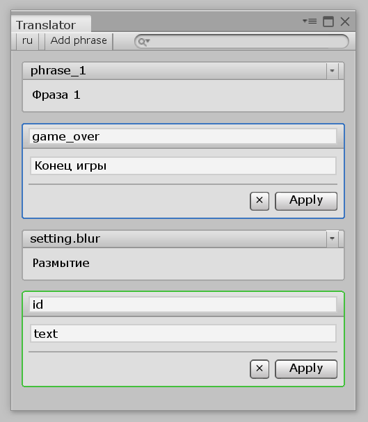

# Редактор языка. Конец

Мы почти закончили работу с редактором. В предыдущих двух частях мы создали основу редактора и элемент интерфейса "Фраза". Дело за малым:

* Добавить логику кнопке "Add phrase"
* Заполнять контейнер фраз фразами из языка
* Реализовать поиск

## Добавление фраз

В методе `SetupLangLayout` класса `Translator` мы оставили следующий код:

```csharp
addBtn.RegisterCallback<MouseUpEvent>((e) =>
{
    /* Добавляем фразу в редактор */
});
```

Пора заменить комментарий на что-то работающее:

```csharp
addBtn.RegisterCallback<MouseUpEvent>((e) =>
{
    var phrase = new UIElements.Phrase(
        Lang,
        "id", "test",
        UIElements.Phrase.PhraseState.Add
    );

    Root.Query("phrase-container").First().Add(phrase);
});
```

В этом коде мы создаем элемент интерфейса "Фраза" и добавляем его в список фраз.

Можете проверить. Открывайте любой язык в редакторе и попробуйте нажать на "Add phrase". Должна появится фраза в состоянии "Add".

## Список фраз языка

Для начала создадим публичное свойство в классе `Translator`, которое возвращает текущий поисковый запрос:

```csharp
public string SQuery
{
    get
    {
        var query = Root.Query<ToolbarPopupSearchField>("search").First().value.TrimEnd();

        if (!sMatchCase)
        {
            query = query.ToLower();
        }

        return query;
    }
}
```

Тут все просто. Мы находим поле поиска и получаем его текст (с вырезанными пробелами в начале и в конце). Если режим проверки по регистру не отмечен, то дополнительно переводим введенный текст в нижний регистр.

Теперь создадим метод `FillPhraseList`, который будет заполнять контейнер фраз фразами из языка:

```csharp
void FillPhraseList()
{
    var phraseContainer = Root.Query("phrase-container").First();

    phraseContainer.Clear();

    foreach (var phrase in Lang.Phrases)
    {
        if (SQuery != "")
        {
            var pId = (sMatchCase) ? phrase.Id : phrase.Id.ToLower();
            var pText = (sMatchCase) ? phrase.Text : phrase.Text.ToLower();

            switch (sFilter)
            {
                case SearchFilter.All:
                    if (!pId.Contains(SQuery) && !pText.Contains(SQuery))
                        continue;
                    break;
                case SearchFilter.ID:
                    if (!pId.Contains(SQuery))
                        continue;
                    break;
                case SearchFilter.Text:
                    if (!pText.Contains(SQuery))
                        continue;
                    break;
            }
        }

        var phraseElem = new UIElements.Phrase(
            Lang,
            phrase.Id, phrase.Text,
            UIElements.Phrase.PhraseState.Normal
        );

        phraseContainer.Add(phraseElem);
    }
}
```

Разберем этот метод подробнее. В самом начале мы находим контейнер фраз и удаляем из него все содержимое:

```csharp
var phraseContainer = Root.Query("phrase-container").First();

phraseContainer.Clear();
```

Дальше, мы начинаем перебирать все фразы выбранного языка. Если поисковая строка пуста, просто создаем элемент интерфейса "Фраза" с данными фразы языка и добавляем в контейнер:

```csharp
var phraseElem = new UIElements.Phrase(
    Lang,
    phrase.Id, phrase.Text,
    UIElements.Phrase.PhraseState.Normal
);

phraseContainer.Add(phraseElem);
```

Если же поисковая строка не пуста, то мы получаем ID и текст фразы в нужном регистре (если требуется), а затем, в зависимости от выбранного поискового фильтра, пытаемся найти поисковый текст в ID или тексте фразы. Если найти не получается, то мы не добавляем данную фразу в список фраз, а сразу переходим к следующей.

Как видите, мы в одном методе объединили и вывод фраз и их поиск. Осталось только вызвать `FillPhraseList` в нужных местах.

Во-первых, в конце метода `SetupLangLayout`.

Во-вторых, в том же методе `SetupLangLayout` мы ранее оставили вот такой код:

```csharp
searchBar.RegisterValueChangedCallback((e) =>
{
    /* Запуск поиска */
});
```

Заменим комментарий на вызов нашего метода:

```csharp
searchBar.RegisterValueChangedCallback((e) =>
{
    FillPhraseList();
});
```

Наконец, нужно вызывать обновление списка фраз при смене настроек поиска в методе `SetupSearchMenu`:

```csharp hl_lines="10 26"
void SetupSearchMenu(ToolbarPopupSearchField searchBar)
{
    foreach (var fName in Enum.GetNames(typeof(SearchFilter)))
    {
        searchBar.menu.AppendAction(
            fName,
            (e) => 
            { 
                sFilter = (SearchFilter)Enum.Parse(typeof(SearchFilter), fName);
                FillPhraseList();
            },
            (e) => 
            { 
                return sFilter.ToString() == fName ? DropdownMenuAction.Status.Checked : DropdownMenuAction.Status.Normal; 
            }
        );
    }

    searchBar.menu.AppendSeparator();

    searchBar.menu.AppendAction(
        "Match case",
        (e) => 
        {
            sMatchCase = !sMatchCase;
            FillPhraseList();
        },
        (e) =>
        {
            return sMatchCase ? DropdownMenuAction.Status.Checked : DropdownMenuAction.Status.Normal;
        }
    );
}
```

## Итог

Мы создали полноценный редактор языка, в котором можно создавать/редактировать и удалять фразы.

[](images/ready-translator.png)