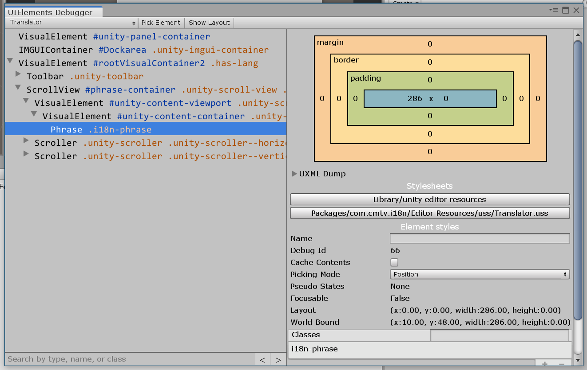
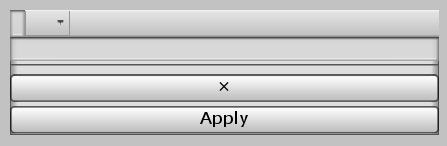
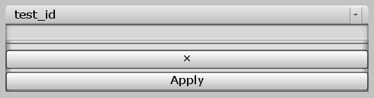
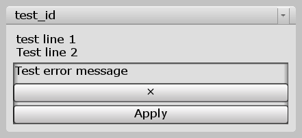
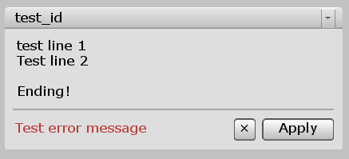
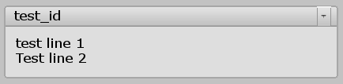
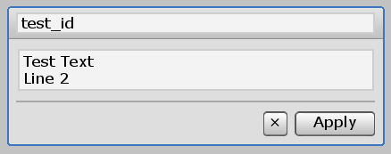
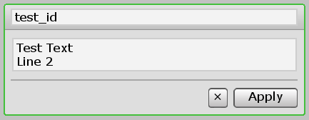
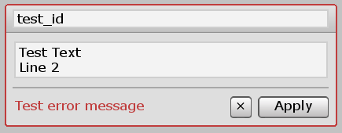
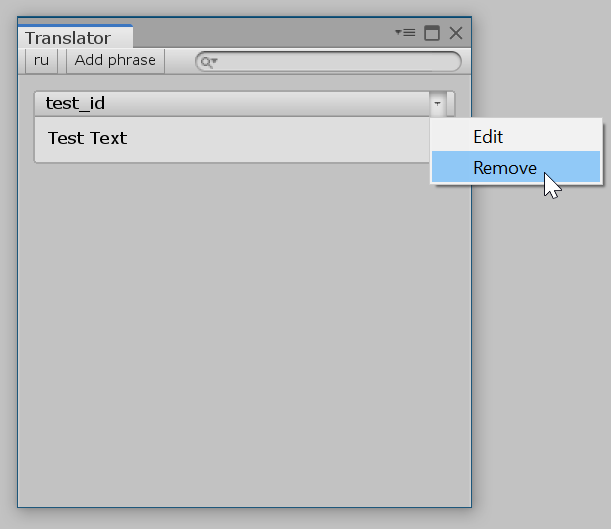

# Редактор языка. Фразы

В предыдущей части мы создали базовый интерфейс редактора языка. В этой части мы создадим контейнер фраз языка, а также сами фразы в виде элементов интерфейса.

## Список фраз

Перейдем к разметке редактора (`Translator.uxml`) и добавим туда контейнер, в котором будут храниться фразы языка:

```xml hl_lines="11 12 13"
<UXML xmlns="UnityEngine.UIElements" xmlns:uie="UnityEditor.UIElements">
    <uie:Toolbar>
        <VisualElement class="actions">
            <uie:ToolbarButton name="lang-switcher" tooltip="Change language..." />
            <uie:ToolbarButton name="add-phrase" text="Add phrase" />
        </VisualElement>

        <uie:ToolbarPopupSearchField name="search" />
    </uie:Toolbar>

    <ScrollView>
        <VisualElement name="phrase-container"></VisualElement>
    </ScrollView>
</UXML>
```

Сразу добавим этому контейнеру отступы со всех сторон в файле `Translator.uss`:

```css
#phrase-container
{
    margin: 10px;
}
```

## Фраза (элемент интерфейса)

Контейнер фраз конечно хорошо, но как должны выглядеть фразы в редакторе? Можно создавать на ходу прямо в коде редактора языка. Но у такого подхода есть серьезные минусы:

* Класс `Translator` станет огромным. Ориентироваться в нем будет практически невозможно
* Произойдет смешивание логики. Получится, что чуть ли не половина класса `Translator` мало относится к самом редактору

Единственный правильный выход — создание собственного элемента интерфейса.

## Основа фразы

Создадим новую папку `UIElements` по пути `Scripts/Editor`. В ней создадим класс `Phrase`:

```csharp
using System;
using UnityEngine;
using UnityEditor;
using UnityEngine.UIElements;
using UnityEditor.UIElements;

namespace I18n.EditorUtilities.UIElements
{
    LanguageAccess lang;

    string _id, _text;

    public class Phrase : VisualElement
    {
        public Phrase(Language lang, string id, string text)
        {
            AddToClassList("i18n-phrase");

            this.lang = new LanguageAccess(lang);

            _id = id;
            _text = text;
        }
    }
}
```

Заметьте, что переменная `lang` имеет тип `LanguageAccess`, так как мы собираемся добавлять/удалять и изменять фразы языка.

Зачем нижнее подчеркивание у переменных `_id` и `_text`? В обычной ситуации они хранят актуальные ID и текст фразы. Но во время ее редактирования, они выполняют роль хранителей предыдущих значений.

Ничего необычного. Сразу при создании элементы мы добавляем ему класс `i18n-phrase`. Это одно из правил хорошего тона при создании своих элементов интерфейса.

## Тестовая фраза

Работать над дизайном фраз мы будем много. Поэтому нужно отобразить хотя-бы одну тестовую фразу в окне редактора языка.

В классе `Translator` подключем пространство имен `UIElements`:

```csharp
using I18n.EditorUtilities.UIElements;
```

 Далее, в самом низу метода `SetupLangLayout` добавим следующие строки:

```csharp
var phraseContainer = Root.Query("phrase-container").First();
phraseContainer.Add(new UIElements.Phrase(Lang, "test_id", "Test Text"));
```

Откройте окно редактора и выберите язык. Никакой фразы, конечно, вы не увидите. Только пустое пространство под шапкой. Но она действительно там есть. Ее можно увидеть в дебаггере:

[{: .w7 }](images/add-test-phrase.png)

Теперь мы можем создавать интерфейс фразы, а затем смотреть на результат в редакторе. Отлично!

## Состояния фразы

У нашей фразы есть четыре состояния:

1. Нормальное (`Normal`)
2. Создание (`Add`)
3. Редактирование (`Edit`)
4. Ошибка (`Error`)

В следующих разделах будет подробно объяснено, зачем эти состояния нам нужны. Если коротко, в зависимости от состояния фразы будет показаны или скрыты некоторые элементы ее интерфейса.

В конец класса `Phrase` добавим перечисление `PhraseState`:

```csharp
public enum PhraseState
{
    Normal, Add, Edit, Error
}
```

Далее, добавим приватную переменную `state` и публичное свойство `State`:

```csharp
#region State

PhraseState state;

public PhraseState State
{
    get => state;

    set
    {
        state = value;

        foreach (var stateStr in Enum.GetNames(typeof(PhraseState)))
        {
            RemoveFromClassList("i18n-phraseState--" + stateStr.ToLower());
        }

        if (state != PhraseState.Normal)
        {
            AddToClassList("i18n-phraseState--edit");
        }

        AddToClassList("i18n-phraseState--" + state.ToString().ToLower());
    }
}

#endregion
```

В `set` мы удаляем все дополнительные классы нашей фразы и добавляем класс, соответствующий текущему состоянию. Например, фраза в обычном состоянии будет иметь класс `i18n-phraseState--normal`.

Если состояние не равно "Normal", то мы добавляем наперед класс `i18n-phraseState--edit`. Это делается для того, чтобы сократить размер таблицы стилей: все стилевые правила для "Edit" будут распространяться на "Add" и "Error".

Осталось немного изменить конструктор фразы: добавить еще один параметр, чтобы можно было указать статус фразы прямо во время ее создания.

```csharp hl_lines="1 7 8 10"
public Phrase(Language lang, string id, string text, PhraseState state = PhraseState.Normal)
{
    AddToClassList("i18n-phrase");

    this.lang = new LanguageAccess(lang);

    _id = (state == PhraseState.Add) ? "" : id;
    _text = (state == PhraseState.Add) ? "" : text;

    State = state;
}
```

Зачем мы устанавливаем `_id` и `_text` пустыми строками при состоянии "Add"? Это нужно для дальнейших проверок. Пустое значение этих переменных говорит о том, что мы добавляем фразу даже когда состояние отлично от "Add".

## Разметка интерфейса

Фраза будет состоять из трех основных частей:

1. Шапка, в которой отображается ID фразы и меню действий (Редактировать и Удалить)
2. Тело, в котором отображается текст фразы
3. Подвал, в котором расположены кнопки (Отменить и Принять), а также текст с возможным сообщением об ошибке

Самое важное, что в зависимости от состояния фразы некоторые части интерфейса будут скрыты. Например, при обычном состоянии подвал фразы не отображается. А в состояниях "Редактируется" и "Ошибка" будет скрыто меню действий.

Создадим файл `Phrase.uxml` по пути `Editor Resources/uxml`:

```xml
<UXML xmlns="UnityEngine.UIElements" xmlns:uie="UnityEditor.UIElements">
    <uie:Toolbar class="i18n-phrase--header">
        <TextField tooltip="Phrase ID" class="i18n-phrase--id" />
        <uie:ToolbarMenu class="i18n-phrase--menu" />
    </uie:Toolbar>

    <Box class="i18n-phrase--body">
        <TextField tooltip="Phrase text" multiline="true" class="i18n-phrase--text" />

        <Box class="i18n-phrase--footer">
            <Label class="i18n-phrase--message" />

            <VisualElement class="i18n-phrase--actions">
                <Button class="i18n-phrase--cancel" text="×" />
                <Button class="i18n-phrase--apply" text="Apply" />
            </VisualElement>
        </Box>
    </Box>
</UXML>
```

Разберем этот код. Сначала идет шапка:

```xml
<uie:Toolbar class="i18n-phrase--header">
    <TextField tooltip="Phrase ID" class="i18n-phrase--id" />
    <uie:ToolbarMenu class="i18n-phrase--menu" />
</uie:Toolbar>
```

В шапке имеется текстовое поле, содержащее ID фразы и кнопка, отображающее выпадающее меню дествий.

```xml
<Box class="i18n-phrase--body">
    <TextField tooltip="Phrase text" multiline="true" class="i18n-phrase--text" />

    <!-- ... -->
</Box>
```

Это тело фразы. Здесь есть текстовое поле, содержащее текст фразы. Поле поддерживает текст с переносами строк.

Наконец, подвал:

```xml
<Box class="i18n-phrase--footer">
    <Label class="i18n-phrase--message" />

    <VisualElement class="i18n-phrase--actions">
        <Button class="i18n-phrase--cancel" text="×" />
        <Button class="i18n-phrase--apply" text="Apply" />
    </VisualElement>
</Box>
```

В левой части сообщение об ошибке, а в правой две кнопки: "Отмена" (крестик) и "Применить". В обычном состоянии подвал не отображается.

Вернемся в класс `Phrase` и загрузим разметку в конструкторе:

```csharp
#region Loading UXML

var uiAsset = AssetDatabase.LoadAssetAtPath<VisualTreeAsset>(Path.UXML("Phrase"));
uiAsset.CloneTree(this);

#endregion
```

Проверим! Откройте любой язык:



Ожидаемо плохо. Исправим это!

## Общие стили

Создаем файл `Phrase.uss` по пути `Editor Resources/uss` и сразу подключим эту таблицу стилей в конструкторе `Phrase`:

```csharp
#region Loading stylesheet

var styleSheet = AssetDatabase.LoadAssetAtPath<StyleSheet>(Path.USS("Phrase"));
styleSheets.Add(styleSheet);

#endregion
```

### Шапка

Вернемся к `Phrase.uss`. Начнем работу с шапки фразы. Задачи:

* Растащить текстовое поле и меню действий в разные стороны
* Уменьшить размер кнопки вызова меню действий
* Убрать задний фон текстового поля
* Растянуть текстовое поле на макимальную ширину
* Добавить (пока) невидимую границу и скосы по углам

```css
/* Header */

.i18n-phrase--header
{
    justify-content: space-between;
    padding: 0 5px;

    border-width: 1px 1px 0;
    border-radius: 3px 3px 0px 0px;
}

.i18n-phrase--id
{
    flex: 1;
}

.i18n-phrase--id TextInput
{
    top: -1px;
    background-image: none;
}

.i18n-phrase--menu
{
    padding-right: 0;
    padding-left: 0;
}
```

Результат:



### Тело

Перейдем к телу. Задачи:

* Сделать задний фон одноцветным
* Добавить отступ текстовому полю со всех сторон
* Убрать задний фон текстового поля
* Добавить (пока) невидимую границу и скосы по углам

```css
/* Body */

.i18n-phrase--body
{
    padding: 6px;
    background-image: none;
    background-color: #DEDEDE;

    border-width: 0 1px 1px 1px;
    border-radius: 0 0 3px 3px;
}

.i18n-phrase--text TextInput
{
    background-image: none;
}
```



### Подвал

Наконец, стилизуем подвал. Задачи:

* Убрать задний фон
* Добавить отделяющую линию с отступами
* Сделать сообщение красным
* Перенести кнопки в правую часть и расположить их в строку

```css
/* Footer */

.i18n-phrase--footer
{
    border-top-width: 1px;
    border-color: #A7A7A7;

    margin-top: 5px;
    padding-top: 5px;

    background-image: none;

    flex-direction: row;
    justify-content: space-between;
    align-items: center;
}

.i18n-phrase--message
{
    flex: 1;
    color: #C03C3C;
    white-space: normal;
}

.i18n-phrase--actions
{
    flex-direction: row;
}

.i18n-phrase--apply
{
    width: 60px;
    margin-left: 5px;
}
```



Надпись "Test error message" я в целях теста добавил через атрибут `text` у элемента с классом `i18n-phrase--message`. Без этого текста кнопки "съедут" влево.

## Стили состояний

Общий дизайн фразы готов. Начнем теперь менять интерфейс в зависимости от текущего состояния. Но как? Выше мы сделали так, чтобы у фразы в зависимости от состояния был свой класс. Теперь мы используем эти классы чтобы скрывать/показывать/преобразовывать определенные элементы.

### Состояние "Normal"

Задачи:

* Серая граница фразы
* Скрыть подвал

```css
/* State - Normal */

.i18n-phraseState--normal .i18n-phrase--header,
.i18n-phraseState--normal .i18n-phrase--body
{
    border-color: #A7A7A7;
}

.i18n-phraseState--normal .i18n-phrase--footer
{
    display: none;
}
```



Именно так и будет выглядеть фраза в обычном виде. Очень лаконично, на мой взгляд.

### Состояние "Edit"

Стили этого состояния распространяются на оставшиеся два: "Add", "Error", так как класс `i18n-phraseState--edit` добавляется автоматически для всех трех состояний: "Add", "Edit" и "Error".

Задачи:

* Синяя граница фразы
* Скрыть меню действий
* Скрыть сообщение об ошибке
* Визуально выделить текстовые поля ID и текста

```css
/* State - Edit */

.i18n-phraseState--edit .i18n-phrase--header,
.i18n-phraseState--edit .i18n-phrase--body
{
    border-color: #3C76C0;
}

.i18n-phraseState--edit .i18n-phrase--menu
{
    display: none;
}

.i18n-phraseState--edit .i18n-phrase--header
{
    height: 25px;
    align-items: center;
}

.i18n-phraseState--edit .i18n-phrase--id TextInput
{
    top: 0;
}

.i18n-phraseState--edit .i18n-phrase--id TextInput,
.i18n-phraseState--edit .i18n-phrase--text TextInput
{
    margin: 1px;
    background-color: #F3F3F3;
    border-width: 1px;
    border-color: #CECECE;
}

.i18n-phraseState--edit .i18n-phrase--message
{
    visibility: hidden;
}
```

Чтобы проверить фразу в этом состоянии, откройте класс `Translator` и в конце метода `SetupLangLayout` найдите строчку, с помощью которого мы добавляли тестовую фразу. Добавьте в скобки последний аргумент с указанием нужного состояния:

```csharp
phraseContainer.Add(new UIElements.Phrase(Lang, "test_id", "Test Text", UIElements.Phrase.PhraseState.Edit));
```

Этот же способ будем использовать для проверки состояний "Add" и "Error".

Проверяем "Edit":



### Состояние "Add"

Задачи:

* Зеленая граница фразы
* Скрыть сообщение об ошибке

```css
/* State - Add */

.i18n-phraseState--add .i18n-phrase--header,
.i18n-phraseState--add .i18n-phrase--body
{
    border-color: #43C03C;
}

.i18n-phraseState--add .i18n-phrase--message
{
    visibility: hidden;
}

```



### Состояние "Error"

Задачи:

* Красная граница фразы

```css
/* State - Error */

.i18n-phraseState--error .i18n-phrase--header,
.i18n-phraseState--error .i18n-phrase--body
{
    border-color: #C03C3C;
}

.i18n-phraseState--error .i18n-phrase--message
{
    visibility: visible;
}
```



## Логика

Фраза выглядит шикарно. Осталось оживить ее с помощью логики.

### ID и текст фразы

Сейчас текстовые поля ID и текста фразы всегда пустые. Нам нужно заполнить их сразу после создания фразы. Кроме того, нужно запретить менять значения полей, когда фраза в состоянии "Normal".

В конструкторе класса `Phrase` создаем следующий раздел кода:

```csharp
#region Initializing Id and Text fields

var idElem = this.Query<TextField>(className: "i18n-phrase--id").First();
var textElem = this.Query<TextField>(className: "i18n-phrase--text").First();

idElem.value = id;
textElem.value = text;

Action<TextField, string> valueChangeFunc = (textField, oldValue) =>
{
    if (State == PhraseState.Normal)
    {
        textField.value = oldValue;
    }
};

idElem.RegisterValueChangedCallback(e => valueChangeFunc(idElem, _id));
textElem.RegisterValueChangedCallback(e => valueChangeFunc(textElem, _text));

#endregion
```

Создадим теперь публичные свойства `Id` и `Text` в теле класса для получения и установки текущих значений в этих текстовых полях. Эти свойства потребуются нам позже.

```csharp
public string Id
{
    get
    {
        return this.Query<TextField>(className: "i18n-phrase--id").First().value.Trim();
    }

    set
    {
        this.Query<TextField>(className: "i18n-phrase--id").First().value = value;
    }
}

public string Text
{
    get
    {
        return this.Query<TextField>(className: "i18n-phrase--text").First().value.Trim();
    }

    set
    {
        this.Query<TextField>(className: "i18n-phrase--text").First().value = value;
    }
}
```

### Работа с фразами

Создадим в классе `Phrase` регион `Language phrases` для методов добавления/редактирования и удаления фраз языка.

Начнем с удаления. Метод `RemovePhrase`:

```csharp
void RemovePhrase(string id)
{
    foreach (var phrase in lang.phrases)
    {
        if (phrase.Id == lang.Lang.GetId(id))
        {
            lang.phrases.Remove(phrase);
            break;
        }
    }

    lang.Save();
}
```

Обратите внимание! В этом и следующих ниже методах мы не используем полученный извне `id` напрямую, а пропускаем его через функцию `GetId()`. Мы делаем это потому что `id` может содержать знаки пунктуации в конце.

Далее идет метод `AddEditPhrase`, который совмещает в себе функции добавления и изменения фраз. Если `oldId` — пустая строка, то ничего удалено не удалится, а будет добавлена новая фраза.

```csharp
void AddEditPhrase(string oldId, string id, string text)
{
    RemovePhrase(oldId);

    lang.phrases.Add(new I18n.Phrase(lang.Lang.GetId(id), text));
    lang.Save();
}
```

Остался только метод `CanAddEditPhrase`, который возвращает текст ошибки, если добавить/изменить фразу нельзя. Он возвращает `null`, если добавить/изменить можно:

```csharp
string CanAddEditPhrase(string oldId, string id)
{
    if (id == "")
    {
        return "Phrase ID can't be empty!";
    }

    var phrase = lang.Lang.GetPhrase(id, strict: true);

    if (phrase != null && oldId == "")
    {
        return "Phrase ID must be unique!";
    }

    return null;
}
```

### Меню действий

В классе `Phrase` создадим новый метод `SetupMenu`:

```csharp
void SetupMenu()
{
    var menuElem = this.Query<ToolbarMenu>(className: "i18n-phrase--menu").First();

    menuElem.menu.AppendAction("Edit", (e) =>
    {
        State = PhraseState.Edit;
    });

    menuElem.menu.AppendAction("Remove", (e) =>
    {
        if (EditorUtility.DisplayDialog("Remove phrase?", _id, "Remove", "Cancel"))
        {
            RemovePhrase(_id);
            RemoveFromHierarchy();
        }
    });
}
```

Мы добавляем два действия: "Редактировать" и "Удалить". Нажатие на "Редактировать" просто переключает текущее состояние на "Edit". Нажатие на "Удалить" показывает всплывающее окно подтверждения операции. Последующий клик по кнопке "Remove" удаляет фразу из языка, а затем и сам элемент интерфейса.

Для того, чтобы меню заработало, не забудьте вызвать функцию `SetupMenu` внизу конструктора класса `Phrase`!

[{: .w5 }](images/menu.png)

### Кнопки "Отмена" и "Принять"

Осталось дописать логику для кнопок "Отмена" (крестик) и "Принять", которые появляются в состояниях "Add", "Edit" и "Error".

Для начала создадим два вспомогательных метода `ResetValues` и `SetDefaultValues`. Первый возвращает значения текстовых полей к значениям переменных `_id` и `_text`. Второй, наоборот, обновляет эти переменные значениями из текстовых полей:

```csharp
void RevertValues()
{
    Id = _id;
    Text = _text;
}

void UpdateDefaultValues()
{
    _id = Id;
    _text = Text;
}
```

Теперь создадим метод `SetupActions` в классе `Phrase`:

```csharp
void SetupActions()
{
    Button cancel, apply;

    cancel = this.Query<Button>(className: "i18n-phrase--cancel").First();
    apply = this.Query<Button>(className: "i18n-phrase--apply").First();

    cancel.RegisterCallback<MouseUpEvent>(e =>
    {
        if (_id == "")
        {
            RemoveFromHierarchy();
        }
        else
        {
            RevertValues();
            State = PhraseState.Normal;
        }
    });

    apply.RegisterCallback<MouseUpEvent>(e =>
    {
        var canAddEdit = CanAddEditPhrase(_id, Id);

        if (canAddEdit != null)
        {
            this.Query<Label>(className: "i18n-phrase--message").First().text = canAddEdit;
            State = PhraseState.Error;
            return;
        }

        AddEditPhrase(_id, Id, Text);
        UpdateDefaultValues();

        State = PhraseState.Normal;
    });
}
```

Поясню поведение кнопки `cancel`. При нажатии идет провека. Если начальный ID фразы равен пустой фразе, это означает, что мы добавляем новую фразу. А раз мы отменяем добавление новой фразы, то можно вообще удалить этот элемент интерфейса.

Если же начальный ID имеется, значит мы редактируем фразу. В этом случае откатываем изменения (`RevertValues`) и устанавливаем состояние "Normal".

Разберемся теперь с кнопкой `apply`. Сначала мы вызываем метод `CanAddEditPhrase`, который возвращает текст ошибки или `null`. Если он вернул текст ошибки, то копируем этот текст в сообщение в интерфейсе и устанавливаем состояние "Error".

Если текста ошибки нет, добавляем/редактируем фразу, обновляем значения переменных `_id` и `_text` с помощью `UpdateDefaultValues` и устанавливаем состояние "Normal".

Не забудьте добавить вызов метода `SetupActions` в конструктор `Phrase`!