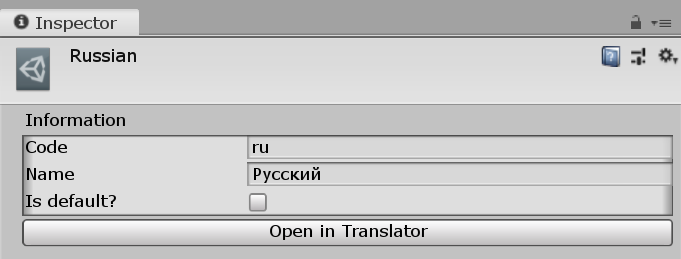
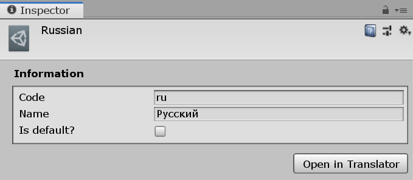

# Инспектор языка

Сейчас инспектор языка выглядит максимально плохо. Улучшим его вид с помощью UI Elements.

## Подготовка

В корне пакета создаем папку `Editor Resources`, а внутри еще две папки `uxml` и `uss`. Как вы уже догадались, в этих папках будут храниться `uxml` файлы разметки и таблицы стилей.

В папке `Scripts/Editor` создаем класс `Path`, который позволит возвращать путь к `uxml` и `uss` файлам:

```csharp
namespace I18n.EditorUtilities
{
    public class Path
    {
        const string UXML_PATH = "Packages/com.cmtv.i18n/Editor Resources/uxml/";
        const string USS_PATH = "Packages/com.cmtv.i18n/Editor Resources/uss/";

        public static string UXML(string name)
        {
            return UXML_PATH + name + ".uxml";
        }

        public static string USS(string name)
        {
            return USS_PATH + name +  ".uss";
        }
    }
}
```

Теперь вместо прописывания полного пути к файлу `Layout.uxml` можно просто написать `Path.UXML("Layout")`.

## Переопределение инспектора

В папке `Scripts/Editor` создадим класс `LanguageInspector`:

```csharp
using UnityEngine;
using UnityEditor;
using UnityEngine.UIElements;

namespace I18n.EditorUtilities
{
    [CustomEditor(typeof(Language))]
    public class LanguageInspector : Editor
    {
        VisualElement root;

        public override VisualElement CreateInspectorGUI()
        {
            root = new VisualElement();

            return root;
        }

        protected override bool ShouldHideOpenButton()
        {
            return true;
        }
    }
}
```

Как вы могли заметить, здесь мы не используем метод `OnInspectorGUI`. Он был бы нужен, если бы мы использовали IMGUI, но мы работает с UI Elements, поэтому используем метод `CreateInspectorGUI`, который просит вернуть древо элементов. За древо элементов отвечает переменная `root`.

Метод `ShouldHideOpenButton` скрывает бесполезную кнопку "Open" в шапке инспектора.

## Построение интерфейса

Пришло время занятся самим интерфейсом инспектора. Основная задача — сделать красивый интерфейс для редактирования кода языка и его названия.
Кроме того, нужно добавить кнопку "Редактировать", которая будет открывать окно редактора языка.

Создадим два файла: `LanguageInspector.uxml` и `LanguageInspector.uss` в папках `Editor Resources/uxml` и `Editor Resources/uss` соответственно.

### UXML разметка

```xml
<UXML xmlns="UnityEngine.UIElements">
    <VisualElement class="language-info">
        <Label class="header" text="Information" />

        <Box>
            <TextField name="code" label="Code" />
            <TextField name="name" label="Name" />
            <Toggle name="is-default" label="Is default?" />
        </Box>
    </VisualElement>

    <Button name="open" text="Open in Translator" />
</UXML>
```

### Подключение разметки

Разметка готова. Теперь нужно ее использовать в классе `LanguageInspector`.

```csharp
public override VisualElement CreateInspectorGUI()
{
    root = new VisualElement();

    #region Loading UXML

    var uiAsset = AssetDatabase.LoadAssetAtPath<VisualTreeAsset>(Path.UXML("LanguageInspector"));
    uiAsset.CloneTree(root);

    #endregion

    return root;
}
```

Результат уже можно увидеть, выделив любой язык в проекте:

[{: .w7 }](images/uxml-loaded.png)

Выглядит пока страшновато, но мы поправим это стилями.

### Таблица стилей

Откроем файл `LanguageInspector.uss` и начнем творить:

```css
.header
{
    font-style: bold;
    margin: 5px 0;
}

Box
{
    padding: 5px;
    -unity-slice-left: 2px;
    -unity-slice-right: 2px;
}

#open
{
    align-self: flex-end;
    padding: 5px 10px;
    margin-top: 10px;
}
```

* Заголовок "Информация" и все ему подобные теперь написаны жирным шрифтом, а также имеют отступы сверху и снизу
* Добавлен внутренний отступ контейнеру. Немного магии `-unity-slice-...`, чтобы поправить размытый задний фон границ контейнера
* Кнопка "Открыть в Tranlsator" перенесена в правую часть инспектора. Добавлены отступы

### Подключение стилей

Пора подключить созданную таблицу стилей к нашему инспектору. Возвращаемся в класс `LanguageInspector`.

```csharp
public override VisualElement CreateInspectorGUI()
{
    root = new VisualElement();

    #region Loading UXML

    var uiAsset = AssetDatabase.LoadAssetAtPath<VisualTreeAsset>(Path.UXML("LanguageInspector"));
    uiAsset.CloneTree(root);

    #endregion

    #region Loading stylesheet

    var styleSheet = AssetDatabase.LoadAssetAtPath<StyleSheet>(Path.USS("LanguageInspector"));
    root.styleSheets.Add(styleSheet);

    #endregion

    return root;
}
```

Результат:

[{: .w7 }](images/uxml-styled.png)

Другое дело! Сравните с результатом из раздела "[Подключение разметки](#подключение-разметки)"!

## Логика

Инспектор получился красивым, но он абсолютно ничего не умеет и никак не связан с выбранным языком. Пора это исправить!

### Код и имя языка

У нас есть текстовые поля для кода и имени языка. Нужно найти эти поля в классе `LanguageInspector` и при каждом их изменении изменять соответствующие переменные языка.

Сначала создадим свойства в теле класса для быстрого доступа к коду и названию языка. Но как это сделать? Ведь эти перменные имеют уровень доступа `private`! Помните, что мы пометили их атрибутом `[SerializeField]`? Именно из-за этого мы можем получить и даже изменить их значения с помощью переменной `serializedObject`.

```csharp
SerializedProperty Code => serializedObject.FindProperty("info.code");
SerializedProperty Name => serializedObject.FindProperty("info.name");
```

Теперь, внутри метода `CreateInspectorGUI` перед `return root;` создаем еще один раздел кода, в котором ловим изменение тектовых полей и записываем результаты в язык:

```csharp
#region Language code and name

TextField code, name;

code = root.Query<TextField>("code").First();
name = root.Query<TextField>("name").First();

code.value = Code.stringValue;
name.value = Name.stringValue;

code.RegisterValueChangedCallback((e) => 
{
    Code.stringValue = e.newValue;
    serializedObject.ApplyModifiedPropertiesWithoutUndo();
});

name.RegisterValueChangedCallback((e) =>
{
    Name.stringValue = e.newValue;
    serializedObject.ApplyModifiedPropertiesWithoutUndo();
});

#endregion
```

В коде выше с помощью методов UQuery находим текстовые поля. Затем заполняем их актуальными даннымы: кодом и названием языка. Наконец, мы отлавливаем любые изменения текстовых полей и обновляем данные языка.

### Переключатель "По умолчанию?"

Выполним аналогичные действия по отношению к переключателю "Is default?".

Добавляем свойство:

```csharp
SerializedProperty IsDefault => serializedObject.FindProperty("isDefault");
```

Добавляем раздел `"Is default" toggle` в метод `CreateInspectorGUI`:

```csharp
#region "Is default" toggle

Toggle isDefault = root.Query<Toggle>("is-default").First();

isDefault.value = IsDefault.boolValue;

isDefault.RegisterValueChangedCallback(e =>
{
    IsDefault.boolValue = e.newValue;
    serializedObject.ApplyModifiedPropertiesWithoutUndo();
});

#endregion
```

### Кнопка открытия редактора

Наконец, добавим немного кода для отлова нажатия на кнопку "Open in Translator" в метод `CreateInspectorGUI`.

```csharp
#region "Open in Translator" button

Button openButton = root.Query<Button>("open").First();

openButton.RegisterCallback<MouseUpEvent>(e => 
{
    // TODO: Open Translator editor window
});

#endregion
```

Так как редактор языка еще не написан, оставляем комментарий. Позже заменим его на вызов редактора.

## Итог

Привожу полный код инспектора:

```csharp
using UnityEngine;
using UnityEditor;
using UnityEngine.UIElements;

namespace I18n.EditorUtilities
{
    [CustomEditor(typeof(Language))]
    public class LanguageInspector : Editor
    {
        VisualElement root;

        SerializedProperty Code => serializedObject.FindProperty("info.code");
        SerializedProperty Name => serializedObject.FindProperty("info.name");
        SerializedProperty IsDefault => serializedObject.FindProperty("isDefault");

        public override VisualElement CreateInspectorGUI()
        {
            root = new VisualElement();

            #region Loading UXML

            var uiAsset = AssetDatabase.LoadAssetAtPath<VisualTreeAsset>(Path.UXML("LanguageInspector"));
            uiAsset.CloneTree(root);

            #endregion

            #region Loading stylesheet

            var styleSheet = AssetDatabase.LoadAssetAtPath<StyleSheet>(Path.USS("LanguageInspector"));
            root.styleSheets.Add(styleSheet);

            #endregion

            #region Language code and name

            TextField code, name;

            code = root.Query<TextField>("code").First();
            name = root.Query<TextField>("name").First();

            code.value = Code.stringValue;
            name.value = Name.stringValue;

            code.RegisterValueChangedCallback((e) => 
            {
                Code.stringValue = e.newValue;
                serializedObject.ApplyModifiedPropertiesWithoutUndo();
            });

            name.RegisterValueChangedCallback((e) =>
            {
                Name.stringValue = e.newValue;
                serializedObject.ApplyModifiedPropertiesWithoutUndo();
            });

            #endregion

            #region "Is default" toggle

            Toggle isDefault = root.Query<Toggle>("is-default").First();

            isDefault.value = IsDefault.boolValue;

            isDefault.RegisterValueChangedCallback(e =>
            {
                IsDefault.boolValue = e.newValue;
                serializedObject.ApplyModifiedPropertiesWithoutUndo();
            });

            #endregion

            #region "Open in Translator" button

            Button openButton = root.Query<Button>("open").First();
  
            openButton.RegisterCallback<MouseUpEvent>(e => 
            {
                // TODO: Open Translator editor window
            });

            #endregion

            return root;
        }

        protected override bool ShouldHideOpenButton()
        {
            return true;
        }
    }
}
```