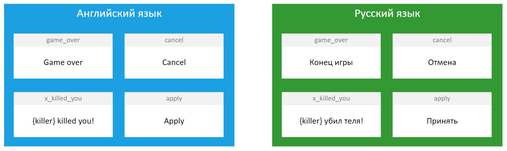
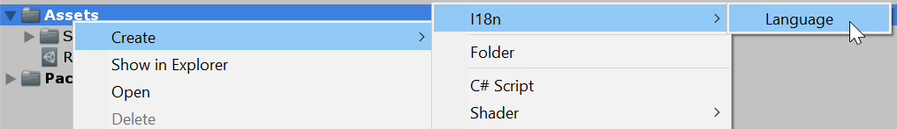

# Язык

Пора создать базовые классы, составляющие фундамент пакета.

## Структура "Информация о языке"

Нам нужно как-то различать один язык от другого. Какие параметры имеет любой язык? Его название ("Русский") и код ("ru").

Создадим структуру `LanguageInfo` в папке `Runtime`, которая хранит эти две переменные. Почему структура? Потому что она требует меньше ресурсов, а передавать ее по ссылке мы все равно не будем.

```csharp
using System;
using UnityEngine;

namespace I18n
{
    [Serializable]
    public struct LanguageInfo
    {
        [SerializeField]
        string code, name;

        public LanguageInfo(string code, string name)
        {
            this.code = code;
            this.name = name;
        }

        public string Code => code;
        public string Name => name;
    }
}
```

Обратите внимание на то, что наша структура помечена атрибутом `[Serializable]`. Атрибут нужен потому что в будущем мы будем хранить объекты этой структуры в `ScriptableObject`, а он сохраняет только сериализуемые объекты. Другими словами, если этот атрибут убрать, то после каждого перезапуска Unity наш язык будет забывать, кто он и как его зовут.

Также стоит отметить атрибут `[SerializeField]` с его помощью мы можем редактировать приватные переменные структуры внутри Unity, но не можем сделать это напрямую из кода. Это сделано намеренно. Нам не нужно, чтобы у других программистов была возможность изменить информацию о языке каким либо образом кроме редактора Unity.

Единственное, что мы позволяем делать изнутри кода — читать значения переменных. Для этого создаем два публичных `get` свойства под каждую переменную:

```csharp
public string Code => code;
public string Name => name;
```

## Структура "Фраза"

Вспомните раздел "[Как использовать I18n](../about/index.md#как-использовать-i18n)". Там мы используем метод `Phrase("game_over")`. Но что на самом деле происходит в момент вызова этого метода?

Любой язык в I18n состоит из набора фраз. Фраза — две переменные: идентификатор фразы и ее текст. Например, у нас есть английский язык. В нем содержится фраза с идентификатором `game_over` и текстом `Game over`. Но есть и русский язык. Там тоже есть фраза с идентификатором `game_over`, но с другим текстом: `Конец игры`.

[](images/language-structure.png)

В результате вызова `Phrase("game_over")` мы получаем текст фразы нужного языка с данным идентификатором.

Создадим структуру `Phrase` в папке `Runtime`, которая и будет представлять собой фразу.

```csharp
using System;
using UnityEngine;

namespace I18n
{
    [Serializable]
    public struct Phrase
    {
        [SerializeField]
        string id, text;

        public Phrase(string id, string text)
        {
            this.id = id;
            this.text = text;
        }

        public string Id => id;
        public string Text => text;
    }
}
```

Все комментарии к коду из предыдущего раздела работают и для этой структуры.

## Класс "Язык"

Пришло время самих языков. Как мы уже выяснили выше, язык представляет собой лишь набор фраз и информацию о самом себе (название и код). Эта информация никак не зависит от сцен в игре. Поэтому выгоднее всего будет создать язык в виде скриптуемого объекта `ScriptableObject`.

Создадим класс `Language` в папке `Runtime`:

```csharp
using System.Collections.Generic;
using UnityEngine;

namespace I18n
{
    [CreateAssetMenu(fileName = "New Language", menuName = "I18n/Language", order = 0)]
    public class Language : ScriptableObject
    {
        [SerializeField]
        LanguageInfo info;

        List<Phrase> phrases;
    }
}
```

Уже сейчас вы можете создать несколько языковых ассетов. Для где-нибудь внутри проекта кликните правой кнопкой и выберите "Create > I18n > Language".

[](images/create-language.png)

Выделите созданный язык. В инпекторе вы можете задать код языка (например, `ru`) и его название (например, `Русский`).

[{: .w7 }](images/native-language-inspector.png)

Не расслабляйтесь! Мы только начали работу на классом `Language`. Еще много чего надо сделать.

### Информация о языке

Сейчас нет никакой возможности получить информацию о языке изнутри кода. Исправим это путем добавления публичного `get` свойства, которое возвращает переменную `info`:

```csharp
public LanguageInfo Info => info;
```

Напомню еще раз, почему мы не можем просто сделать `info` публичной. Если она будет публичной, какой-нибудь невнимательный программист, который использует ваш пакет, может по ошибке внутри своего ~~говно~~ кода изменить информацию о языке. Это может привести к страшным последствиям. Просто подумайте о том, что произойдет, если у код русского языка (`ru`) внезапно станет равен `en`!

### Работа с фразами

Пора дать другим людям возможность получать текст фразы из языка по ее идентификатору. Другими словами, пора реализовать метод `GetPhrase` и некоторые его вариации!

Сначала добавим библиотеку `System.Linq` в наш файл:

```csharp
using System.Linq;
```

Реализуем базовый вариант `GetPhrase`, который принимает только ID фразы:

```csharp
#region GetPhrase

public string GetPhrase(string id)
{
    var punctuation = new string[] {".", "?", "!", ":", "..."};

    var ending = "";

    foreach (var item in punctuation)
    {
        if (id.EndsWith(item))
        {
            ending = item;
            break;
        }
    }

    id = id.Substring(0, id.LastIndexOf(ending));

    var matches = phrases.Where(phrase => phrase.Id == id);

    if (matches.Count() != 0)
    {
        return matches.First().Text + ending;
    }

    return id;
}

#endregion
```

Этот метод состоит из двух частей. В первой мы ищем знаки пунктуации в конце предоставленного ID: `.`, `?`, `!`, `:`, `...`. Если хоть один из них присутствует в конце ID, мы добавим его в конце текста фразы. Зачем? Например, у нас есть нейтральная фраза с ID `game_over` и текстом `Конец игры`. Но что если мы хотим получить "Конец игры?" или "Конец игры!". Создавать под каждый вариант свою фразу? Неудобно!

А вот с проверкой на пунктуацию в конце ID мы можем просто написать: `GetPhrase("game_over?")` или `GetPhrase("game_over!")` и получить в конце нужный знак.