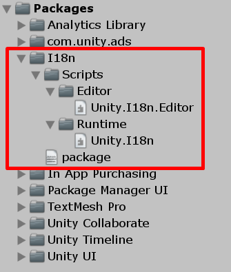

# Пакет

Начать стоит с создания пакета. Сначала создадим пустой Unity проект. Назовем его "I18n".

Переходим в папку "Packages" и создаем там папку `com.cmtv.i18n`. Это, как вы уже догадались, техническое имя пакета.

## `package.json`

Теперь внутри созданной папки пакета нужно создать файл `package.json`:

```json
{
    "name": "com.cmtv.i18n",
    "version": "1.0.0",
    "displayName": "I18n",
    "description": "Some handy tools that help to localise your game!"
}
```

## Сборки

Перед добавлением скриптов нужно создать две сборки: для обычных скриптов и для скиптов редактора.

Создаем папку `Scripts`, а внутри нее еще две: `Runtime` и `Editor`. В обеих папках создаем сборки `Unity.I18n` и `Unity.I18n.Editor` соответственно. У последней сборки в поле "Platforms" убираем флажок с "Any" и оставляем его только у пункта "Editor". Также в последней сборке в разделе "Assembly Definition References" добавим ссылку на `Unity.I18n`.

[](images/ready-package.png)