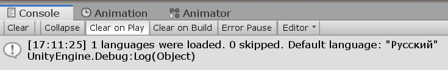

# Менеджер языков

В этой статье мы создадим менеджер языков — особый объект, который будет присутствовать в любой сцене игры. К нему всегда можно будет обратиться из любого скрипта и получить текст фразы по ее ID. Менеджер языков будет реализовывать паттерн "Синглтон".

Что такое [синглтон](https://refactoring.guru/ru/design-patterns/singleton)? Максимально ясно смысл синглтона передает вот эта картинка (*источник Refactoring Guru*):

[{: .w7 }](images/singleton.png)

Это такой паттерн, при котором у некоторого класса может быть только один **единственный экземпляр**, к которому обращаются из разных мест в программе.

Проще пояснить на примере. Нам нужно из любого места в игре быстро получить текст фразы по ее ID. Для этого мы должны обратиться к некоторому одному объекту, который есть во всех сценах игры, и с его помощью получить нужный текст.

## Основа синглтона

Создадим класс `Lang` по пути `Scripts/Runtime`:

```csharp
using UnityEngine;

namespace I18n
{
    public class Lang : MonoBehaviour
    {
        
    }
}
```

Теперь нам нужно превратить этот класс в синглтон, то есть дать другим возможность обращаться к **единственному экземпляру** этого класса.

```csharp
using UnityEngine;

namespace I18n
{
    public class Lang : MonoBehaviour
    {
        #region Singleton

        static Lang _instance;
        public static Lang Instance
        {
            get
            {
                if (_instance == null)
                {
                    GameObject lngManager = new GameObject("Language Manager");
                    _instance = lngManager.AddComponent<Lang>();
                    DontDestroyOnLoad(lngManager);
                }

                return _instance;
            }
        }

        #endregion
    }
}
```

Опишу подробнее, что тут происходит. Сначала мы создаем приватную статическую переменную `_instance`, которая и является единственным экземпляром класса `Lang`.

```csharp
static Lang _instance;
```

Но просто так обращаться к ней мы нельзя. Нужно публичное статическое свойство `Instance`, которое сначала проверяет, был была ли инциализирована переменная `_instance` раньше.

Если нет, то в сцене создается объект "Language Manager", к нему добавляется компонент типа `Lang`. Этим же компонентом инициализируем переменную `_instance`.

```csharp
GameObject lngManager = new GameObject("Language Manager");
_instance = lngManager.AddComponent<Lang>();
```

Затем мы помечаем созданный объект с помощью `DontDestroyOnLoad`. Теперь он не будет пропадать при смене сцены.

```csharp
DontDestroyOnLoad(lngManager);
```

Наконец, мы возвращаем инициализированную переменную `_instance`.

```csharp
return _instance;
```

Заметьте, что свойство (как и переменная) должно быть статическим, чтобы к нему обращались без создания экземпляра класса.

Вот и все. Теперь в **любой** момент в **любой** сцене игры мы можем обратиться к объекту класса `Lang` вот так:

```csharp
Lang.Instance...
```

Если объект `Language Manager` уже есть в сцене, вернется компонент `Lang`. Если его нет, он будет создан и опять же вернется компонент `Lang`. В этом и заключается суть синглтона.

## Инициализация объекта

Нам нужно выполнить множество действий в момент создания объекта `Lang`. Выполнить сканирование готовых языков, выявить дубликаты и прочее. Можно выполнять эти действия прямо в коде создания синглтона, но он очень быстро раздуется.

Поэтому создадим для этих целей отдельный метод `Init` в классе `Lang`, и вызовем его при создании экземпляра синглтона:

```csharp hl_lines="12 22 23 24 25"
#region Singleton

static Lang _instance;
public static Lang Instance
{
    get
    {
        if (_instance == null)
        {
            GameObject lngManager = new GameObject("Language Manager");
            _instance = lngManager.AddComponent<Lang>();
            _instance.Init();
            DontDestroyOnLoad(lngManager);
        }

        return _instance;
    }
}

#endregion

void Init()
{

}
```

Теперь `Init` будет вызываться при первом обращении к синглтону.

## Список готовых языков

В теле класса `Lang` добавим приватный массив языков, а также переменную для языка по умолчанию:

```csharp
Language[] langs;

Language defaultLang;
```

Создадим метод `LoadLangs` и вызовем его в `Init`:

```csharp
void Init()
{
    LoadLangs();
}

void LoadLangs()
{
    /* Загружаем готовые языки здесь */
}
```

Теперь возьмемся за содержимое метода `LoadLangs`. Задачи:

* Найти все языки в папке `Resorces/Languages`
* Определить язык по умолчанию
* Выявить и оповестить пользователя о различных проблемах (пустой код или имя языка, а также дубликаты)

```csharp
void LoadLangs()
{
    Language[] _langs = Resources.LoadAll<Language>("Languages");
    Dictionary<string, Language> langMap = new Dictionary<string, Language>();

    int skipCounter = 0;

    foreach (var lang in _langs)
    {
        if (lang.Info.Code == "")
        {
            Debug.LogWarning("Language \"" + lang.Info.Name + "\" has empty code! Skipping!");
            skipCounter++;
            continue;
        }

        if (lang.Info.Name == "")
        {
            Debug.LogWarning("Language with code \"" + lang.Info.Code + "\" has empty name! Skipping!");
            skipCounter++;
            continue;
        }

        if (langMap.ContainsKey(lang.Info.Code))
        {
            Debug.LogWarning("Code (" + lang.Info.Code + ") duplicate for language \"" + lang.Info.Name + "\". Skipping!");
            skipCounter++;
            continue;
        }

        if (lang.IsDefault)
        {
            defaultLang = lang;
        }

        langMap.Add(lang.Info.Code, lang);
    }

    langs = langMap.Values.ToArray();

    Debug.Log(langs.Length + " languages were loaded. " + skipCounter + " skipped. Default language: \"" + defaultLang.Info.Name + "\"");
}
```

Разберем, что происходит в этом коде. Сначала мы загржаем все доступные языки из папки `Resources/Languages`. Именно из `Resources`, так как только к ней ей доступ во время выполнения игры.

```csharp
Language[] _langs = Resources.LoadAll<Language>("Languages");
```

Дальше мы создаем словарь вида Код - Язык. Он потребуется для проверки на дубликаты ниже.

```csharp
Dictionary<string, Language> langMap = new Dictionary<string, Language>();
```

Счетчик пропущенных языков:

```csharp
int skipCounter = 0;
```

Начинаем перебирать загруженные языки. Каждый язык проверям на предмет пустого ID, имени или дубликата (язык с таким кодом уже был загружен). Если проверка не пройдена, выводим соответствующее сообщение, увеличиваем счетчик пропуска и переходим к следующему языку.

Если язык помечен как "Язык по умолчанию", заменяем текущий язык по умолчанию новым.

```csharp
if (lang.IsDefault)
{
    defaultLang = lang;
}
```

Если проверка пройдена успешно, добавляем язык в словарь.

После проверки всех языков, берем все добавленные языки из словаря и переносим их в переменную `langs` класса. Выводим сообщение о количестве загруженных, пропущенных языков, а также о языке по умолчанию.

```csharp
langs = langMap.Values.ToArray();

var defaultName = defaultLang == null ? "none" : defaultLang.Info.Name;

Debug.Log(langs.Length + " languages were loaded. " + skipCounter + " skipped. Default language: \"" + defaultName + "\"");
```

## Тестирование

Не забудьте перенести все существующие языки проекта в папку `Resources/Languages`!

Чтобы проверить, правильно ли работает загрузка языков, создайте где-нибудь в проекте класс `Test` и прицепите его к любому объекту в сцене:

```csharp
using UnityEngine;
using I18n;

public class Test : MonoBehaviour
{
    // Start is called before the first frame update
    void Start()
    {
        var test = Lang.Instance;
    }

    // Update is called once per frame
    void Update()
    {

    }
}
```

Запустите игру в редакторе. В консоли должно появится сообщение:

[{: .w7 }](images/loaded-langs-log.png)

Кстати, обратите внимание на окно иерархии объектов сцены. Там должен появиться раздел "DontDestoryOnLoad", а внутри будет наш синглтон "Language Manager". При смене сцены он больше никуда не пропадет, можете проверить.


## Язык по коду

Напишем метод `GetLang`, который возвращает язык и загруженного набора по его коду. Он пригодится нам позднее:

```csharp
Language GetLang(string code)
{
    foreach (var lang in langs)
    {
        if (lang.Info.Code == code)
        {
            return lang;
        }
    }

    Debug.LogWarning("No language with code \"" + code + "\" found!");

    return null;
}
```

Если язык с указанным кодом не найден в списке загруженных, то выводится предупреждение в консоль и возвращается `null`.

## Текущий язык

В нашем менеджере уже есть список всех языков и язык по умолчанию. Но это еще не все. Нужно написать код, для хранения и загрузки языка, который выбрал сам игрок.

### Переменные

В классе `Lang` создаем две переменные:

```csharp
Language currentLang;
string currentLangCode;
```

Зачем нужна вторая переменная, если можно обойтись одной? Ответ — для экономии. Зачем сохранять в памяти устройства весь язык, когда можно хранить только его код? На самом деле, есть еще одна причина. Если в будущем мы обновим класс `Language`, то, возможно, считывание давно сохраненного языка будет невыполнимо.

Поэтому, `currentLang` используем в игре, а `currentLangCode` будет сохраняться в памяти устройства.

Создадим еще публичное свойство `Current`, которое возвращает текущий язык. Оно может пригодиться программистам, которые будут использовать наш пакет:

```csharp
public static Language Current => Instance.currentLang;
```

### Сохранение и загрузка

Займемся сохранением и загрузкой переменной `currentLangCode`.

Сначала пропишем вверху класса `Lang` используемые библиотеки:

```csharp
using System.IO;
using System.Runtime.Serialization.Formatters.Binary;
```

Теперь создадим раздел кода "Save and Load current language". Начем с метода `SaveCurrent` (сохранение):

```csharp
#region Save and Load current language

void SaveCurrent()
{
    if (currentLangCode == null)
    {
        return;
    }

    BinaryFormatter bf = new BinaryFormatter();

    using (FileStream file = File.Create(Application.persistentDataPath + "/lang.data"))
    {
        bf.Serialize(file, currentLangCode);
    }
}

#endregion
```

Тут все очень просто.

Если кода текущего языка нет, то ничего сохранять не надо.

Если есть, создаем так называемый "форматтер", который преобразует любой сериализуемый объект в цепочку битов. Затем мы создаем файл `lang.data` по стандартному пути хранения данных и записываем эту цепочку.

Теперь реализуем загрузку сохраненных данных — метод `LoadCurrent`:

```csharp
#region Save and Load current language

void SaveCurrent()
{
    if (currentLangCode == null)
    {
        return;
    }

    BinaryFormatter bf = new BinaryFormatter();

    using (FileStream file = File.Create(Application.persistentDataPath + "/lang.data"))
    {
        bf.Serialize(file, currentLangCode);
    }
}

void LoadCurrent()
{
    if (!File.Exists(Application.persistentDataPath + "/lang.data"))
    {
        return;
    }

    BinaryFormatter bf = new BinaryFormatter();

    using (FileStream file = File.Open(Application.persistentDataPath + "/lang.data", FileMode.Open))
    {
        while (file.Position < file.Length)
        {
            try
            {
                currentLangCode = (string)bf.Deserialize(file);
            }
            catch { }
        }
    }

    currentLang = (currentLangCode == null) ? defaultLang : GetLang(currentLangCode);
}

#endregion
```

Сначала мы проверяем, существует ли вообще файл `lang.data`:

```csharp
if (!File.Exists(Application.persistentDataPath + "/lang.data"))
{
    return;
}
```

Если да, то открываем его и преобразуем данные внутри в строчку, которую записываем в переменную `currentLangCode`.

```csharp
using (FileStream file = File.Open(Application.persistentDataPath + "/lang.data", FileMode.Open))
{
    while (file.Position < file.Length)
    {
        try
        {
            currentLangCode = (string)bf.Deserialize(file);
        }
        catch { }
    }
}
```

Наконец, если `currentLangCode` имеет значение (то есть файл `lang.data` существует и был успешно прочитан), мы устанавливаем выбранный язык, а если нет — используем язык по умолчанию.

```csharp
currentLang = (currentLangCode == null) ? defaultLang : GetLang(currentLangCode);
```

### Вызов

Осталось добавить вызов `LoadCurrent` в методе `Init`:

```csharp hl_lines="4"
void Init()
{
    LoadLangs();
    LoadCurrent();
}
```

Метод `SaveCurrent` будем вызывать при смене языка. Об этом ниже.

## Смена языка

Пора дать возможность пользователю менять текущий выбранный язык.

### Событие смены языка

Подключим вверху класса `Lang` новую библиотеку:

```csharp
using UnityEngine.Events;
```

В теле класса добавим **публичное** событие `onLanguageSwitch`:

```csharp
public UnityEvent onLanguageSwitch = new UnityEvent();
```

Как можно догадаться из названия, это событие будет вызываться в момент, когда изменился текущий язык. Его можно будет прослушивать и обновлять текст в игре.

### Метод смены языка

Создадим метод `Switch`:

```csharp
void Switch(string code)
{
    currentLang = GetLang(code);
    onLanguageSwitch.Invoke();
    SaveCurrent();
}
```

Здесь мы сначала обновляем переменную `currentLang` новым языком. Затем триггерим событие `onLanguageSwitch`. В этот момент все, кто его прослушивают обновляют тексты. Наконец, мы сохраняем новый выбранный язык в память устройства.

## Получение языков

Напишем метод `GetLangs`, который возвращает массив информации о всех загруженных языках:

```csharp
public static LanguageInfo[] GetLangs()
{
    return Instance.langs.Select(language => language.Info).ToArray();
}
```

Этот метод будет очень полезен полезен при создании переключателей языка внутри игры.

## Получение фраз

Осталось написать самый главный метод `Phrase`, который все будут использовать для получения фразы по ее ID.

```csharp
public static string Phrase(string id)
{
    if (Instance.currentLang == null)
    {
        return id;
    }

    return Instance.currentLang.GetPhrase(id);
}
```

Не забудем и про реализацию, которая принимает параметры:

```csharp
public static string Phrase(string id, Dictionary<string, string> phraseParams)
{
    if (Instance.currentLang == null)
    {
        return id;
    }

    return Instance.currentLang.GetPhrase(id, phraseParams);
}
```

Теперь в любом месте в игре можно получить фразу следующим образом:

```csharp
Lang.Prhase("...");
```

Проверим эту функцию в ранее созданом классе `Test`. Выведем в консолько какую-нибудь фразу языка:

```csharp hl_lines="4"
void Start()
{
    var test = Lang.Instance;
    Debug.Log(Lang.Phrase("game_over!"));
}
```

Запускаем игру:

