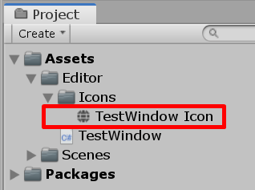
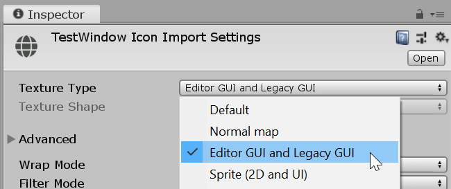
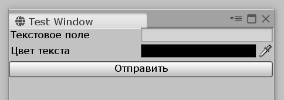
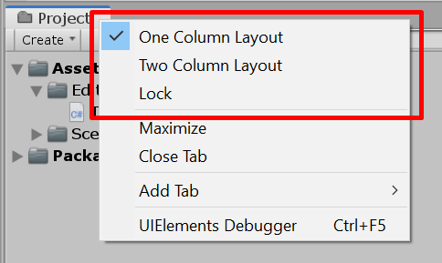
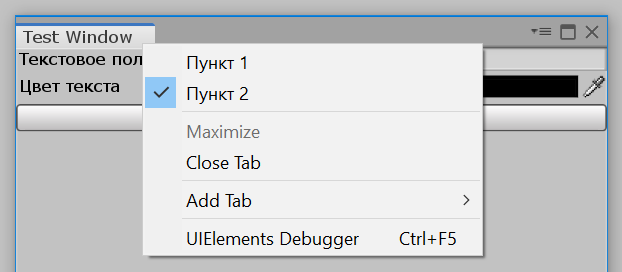

description: Подробные инструкции по созданию собственного окна редактора, пункта в меню, назначению горячих клавиш и иконки, а также множество других полезных данных.

# Окно редактора

Весь редактор Unity состоит из набора окон: Сцена, Проект, Инспектор, Иерархия объектов и так далее... Стандартные окна помогают практически всегда. Но все же часто приходится создавать свои собственные — для выполнения специфичных задач.

В этой статье приведена вся информация по созданию и настройке собственного окна. От C# класса, до контекстного меню и иконки перед названием.

## Основа окна

Так как мы расширяем редактор Unity, в проекте обязательно должна быть папка с названием `Editor`. Внутри этой папки (или какой-то подпапки) создайте C# класс окна. Например, `TestWindow.cs`.


Для начала нужно подключить пространства имен `UnityEngine` и `UnityEditor`. Внутри последнего есть класс `EditorWindow`, от которого наследуют все окна редактора, в том числе и наше окно `TestWindow`:

```csharp
using UnityEngine;
using UnityEditor;

public class TestWindow : EditorWindow
{

}
```

Теперь создадим функцию `ShowWindow`, которая будет задавать начальные параметры окна: название, размеры и другие.

```csharp
using UnityEngine;
using UnityEditor;

public class TestWindow : EditorWindow
{
    public static TestWindow ShowWindow()
    {
        TestWindow window = GetWindow<TestWindow>();

        // Устанавливаем название окна
        window.titleContent = new GUIContent("Test Window");

        // Устанавливаем мин. и макс. размеры
        window.minSize = new Vector2(150, 150);
        window.maxSize = new Vector2(1000, 500);

        return window;
    }
}
```

!!! заметка
    Название функции, ее уровень доступа и тип возвращаемого значения можно выбрать любыми. Я указал именно такие, так как считаю, что с ними работать гораздо удобнее. Настоятельно рекомедную использовать именно их.

## Пункт в меню

Создадим пункт для вызова окна в основном меню Unity. Подобные пункты создаются с помощью атрибута `MenuItem`, который нужно расположить **перед** методом `ShowWindow`. В скобках указывается местоположение пункта.

```csharp hl_lines="6"
using UnityEditor;
using UnityEngine;

public class TestWindow : EditorWindow
{
    [MenuItem("Window/Test Window")]
    public static TestWindow ShowWindow()
    {
        TestWindow window = GetWindow<TestWindow>();

        // Устанавливаем название окна
        window.titleContent = new GUIContent("Test Window");

        // Устанавливаем мин. и макс. размеры
        window.minSize = new Vector2(150, 150);
        window.maxSize = new Vector2(1000, 500);

        return window;
    }
}
```

!!! важно
    С помощью атрибута `MenuItem` невозможно создать пункт прямо в главном меню Unity. Код ниже приведет к ошибке:

    ```csharp
    [MenuItem("Test Window")]
    ```

    Пункт меню обязательно должен иметь родителя, например, "Window" или что-то собственное.

Так как в скобках мы указали `Window/Test Window`, то пункт `Test Window` появится в списке меню `Window`.

{ .border }

Если указать `Lol/Boom`, то в верхней панели Unity будет создан список `Lol` с одним пунктом меню — `Boom`:

{ .border }

## Вызов окна из кода

Для отображения окна нужно просто вызвать метод `ShowWindow`:

```csharp
// ...

TestWindow.ShowWindow();

// ...
```

Бывают случаи, когда нужно изменить некоторые параметры окна во время его создания. Код ниже показывает наше окно с измененным названием:

```csharp
// ...

var window = TestWindow.ShowWindow();
window.titleContent = new GUIContent("Новое название!");

// ...
```

Естественно, обращаясь к переменной `window`, менять можно не только название, но и все остальное (размеры, иконку и т.д.).

## Интерфейс окна

Если два принципиально разных подхода к созданию интерфейса:

* [UI Elements](../../ui/ui-elements/about/index.md) — для продвинутых и сложных интерфейсов
* IMGUI — для простеньких интерфейсов

Подробнее об обеих технологиях читайте в соответствующих разделах учебника. Ниже приведены примеры одного и того же интерфейса, с помощью которого можно отправлять цветные сообщения в консоль Unity. Первый использует технологию UI Elements, а второй — IMGUI.

### UI Elements

У любого окна есть переменная `rootVisualElement`, которая является корневым элементом окна. В этот корневой элемент можно добавлять различные элементы интерфейса, прицеплять таблицы стилей. Лучше всего это делать в методе `OnEnable`.

```csharp
void OnEnable()
{
    // Текстовое поле
    var textField = new TextField("Текстовое поле");
    rootVisualElement.Add(textField);

    // Поле выбора цвета
    var colorField = new ColorField("Цвет текста");
    colorField.showAlpha = false;
    rootVisualElement.Add(colorField);

    //
    // Кнопка "Отправить"
    //

    var applyButton = new Button(() => 
    {
        Debug.Log(
            "<color='#" + ColorUtility.ToHtmlStringRGB(colorField.value) + "'>" 
            + textField.value + 
            "</color>"
        );
    });

    applyButton.text = "Отправить";
    rootVisualElement.Add(applyButton);
}
```

{ .border }

### IMGUI

Отрисовку интерфейса с помощью IMGUI нужно выполнять в методе `OnGUI`:

```csharp
string text;
Color color;

void OnGUI()
{
    // Текстовое поле
    text = EditorGUILayout.TextField("Текстовое поле", text);

    // Поле выбора цвета
    color = EditorGUILayout.ColorField(new GUIContent("Цвет текста"), color, true, false, false);

    // Кнопка "Отправить"
    if (GUI.Button(new Rect(10, 50, 150 ,30), "Отправить"))
    {
        Debug.Log(
            "<color='#" + ColorUtility.ToHtmlStringRGB(color) + "'>" 
            + text + 
            "</color>"
        );
    }
}
```

{ .border }

## Горячая клавиша

Горячую клавишу для окна можно назначить в конце атрибута `MenuItem` через пробел для отделения от местоположения пункта меню.

Пример горячей клавиши, которая открывает наше окно по нажатию на "Shift + G":

```csharp
[MenuItem("... #g")]
```

Под троеточием скрывается путь к пункту меню. Он нам не нужен. Сама горячая клавиша определяется так: `#t`. `#` — специальный символ, обозначающий клавишу Shift. Список доступных символов:

* `#` — Shift
* `&` — Alt
* `LEFT`, `RIGHT`, `UP`, `DOWN` — клавиши стрелок
* `F1...F12` — клавиши от F1 до F12
* `HOME`, `END`, `PGUP`, `PGDN`

Если горячей клавишей является какая-то обычная буквенная клавиша, то перед ней нужно поставить `_`. Пример открытия окна по клавише `G`:

```csharp
[MenuItem("... _g")]
```

## Иконка окна

У любого окна Unity есть собственная икона. Это просто красиво. А у нашего окна нет. Из-за этого оно выглядит не законченным.

### Подготовка

Размер иконки может быть любым — она в любом случае будет уменьшена до нужных размеров (по высоте). Желательно, чтобы иконка была квадратной. Можно сделать и широкий прямоугольник, но выглядеть будет странно.

Обязательно делайте отступы сверху и снизу внутри самой иконки. Если их не делать, то она некрасиво впишется в вкладку окна.

Вот пример хорошей иконки (64x64, с отступами в 8 пикселей со всех сторон):

{ .border }

### Расположение и настройка

Переместите иконку куда-нибудь внутрь вашего Unity проекта. В этом примере я создал папку `Icons` внутри папки `Editor`:

{ .border }

Название иконки не имеет значения. Теперь выделите иконку в окне "Project", перейдите в инспектор и в поле "Texture Type" укажите "Editor GUI and Legacy GUI". Затем кликните по "Apply" внизу инспектора.

{ .w8 .border }

### Применение к окну

Внутри метода `ShowWindow` есть строчка, в который мы задаем название окна:

```csharp
public static TestWindow ShowWindow()
{
    // ...

    // Устанавливаем название окна
    window.titleContent = new GUIContent("Test Window");

    // ...
}
```

Внутри этого метода получим иконку с указанием типа `Texture`, а затем передадим ее в качестве второго аргумента объекту `GUIContent`:

```csharp
public static TestWindow ShowWindow()
{
    // ...

    // Находим иконку
    Texture icon = AssetDatabase.LoadAssetAtPath<Texture>("Assets/Editor/Icons/TestWindow Icon.png");

    // Устанавливаем название окна и иконку
    window.titleContent = new GUIContent("Test Window", icon);

    // ...
}
```

Вот и все! Теперь у нашего окна есть красивая иконка:



## Контекстное меню окна

Если кликнуть по названию окна правой кнопкой мыши, появится контекстное меню этого окна. В нем можно развернуть окно на весь экран (Maximize), закрыть окно и добавить новую вкладку. Это все стандартные действия.

Но многие окна Unity добавляют собственные пункты в эти меню. Например, в контекстном меню окна "Project" можно выбрать, как отображать файлы: в одну или в две колонки. На рисунке ниже эти пункты выделены красным прямоугольником.

{ .border }

Для добавления собственных пунктов в меню нужно реализовать интерфейс `IHasCustomMenu`. Добавьте его через запятую после `EditorWindow` в объявлении класса:

```csharp
// ...

public class TestWindow : EditorWindow, IHasCustomMenu
{

// ...
```

Интерфейс `IHasCustomMenu` требует, чтобы вы реализовали метод `AddItemsToMenu` в классе. Добавляем этот метод:

```csharp
public void AddItemsToMenu(GenericMenu menu)
{

}
```

У этого метода есть параметр `menu`, который и является контекстным меню окна. Добавлять новые элементы нужно с помощью вызова метода `menu.AddItem(...)`. Пример:

```csharp
bool is2Active = false;

public void AddItemsToMenu(GenericMenu menu)
{
    menu.AddItem(new GUIContent("Пункт 1"), false, () =>
    {
        Debug.Log("Кликнули по 1!");
    });

    menu.AddItem(new GUIContent("Пункт 2"), is2Active, () =>
    {
        Debug.Log("Кликнули по 2!");
        is2Active = !is2Active;
    });
}
```

Мы добавили два пункта в меню. Щелчки по обоим выводят соответствующие сообщения в консоль Unity. Второй пункт можно активировать/деактивировать щелчком. В переменной `is2Active` хранится состояние второго пункта меню.

{ .w7 .border }

!!! важно
    Не храните переменные внутри метода `AddItemsToMenu`, так как он выполняется после каждого открытия меню! Если бы переменная `is2Active` была внутри метода, она каждый раз принимала бы стартовое значение `false`.