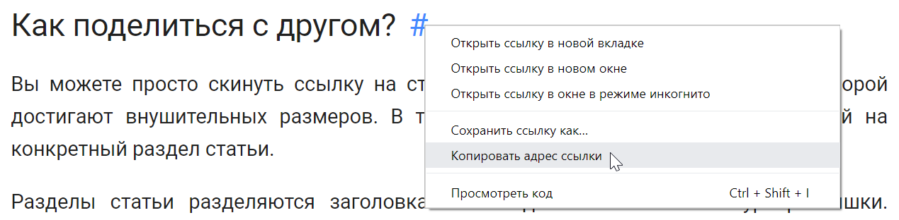

description: Подробный и понятный учебник по редактору Unity. Научитесь создавать игры, разберитесь во всех тонкостях движка! Присоединяйтесь!

# Учебник по Unity

Хотите создать игру? Не получается реализовать какую-то механику? Трудности с Unity?

Вы по адресу! Добро пожаловать в интересный, понятный и подробный учебник по редактору Unity!

## У меня вопрос/проблема!

Если что-то не работает, но должно, или (что еще хуже), что-то работает, но не должно, смело обращайтесь на [форум](https://ounity.ru) за помощью.

Кстати, там можно не только просить о помощи, но еще и общаться с другими создателями игр, обмениваться опытом и рекламировать свои игры!

## Как поделиться с другом?

Вы можете просто скинуть ссылку на статью. Однако, статьи на данном сайте порой достигают внушительных размеров. В таком случае, можно поделиться ссылкой на конкретный раздел статьи.

Разделы статьи разделяются заголовками. Наведите на заголовок курсор мышки. Справа от него появится значок ссылки. Нажмите на него правой кнопкой и выберите пункт "Копировать адрес ссылки".

[{ .w8 .border }](index/images/share.png)

## Вклад в учебник

Вы можете **вносить правки** в существующие статьи, **добавлять свои** собственные, а также **предлагать** идеи для новых статей. Сделать это очень просто. Откройте pull request через GitHub со своими правками. Мы рассмотрим их и добавим в учебник!

## О учебнике

На просторах интернета мало информации по Unity на русском языке. Официальная документация переведена лишь местами. Получается, что нет единого источника информации, который поддерживается **сообществом**, а не **единственным автором**.

Здесь мы реализуем другой подход.

Сайт является работает на статическом генераторе [MkDocs](https://www.mkdocs.org/) с темой [Material](https://squidfunk.github.io/mkdocs-material/). Такой подход позволяет не возиться с исходниками сайта, а писать статьи в удобной markdown разметке, которая автоматически собирается в готовый и красивый сайт.