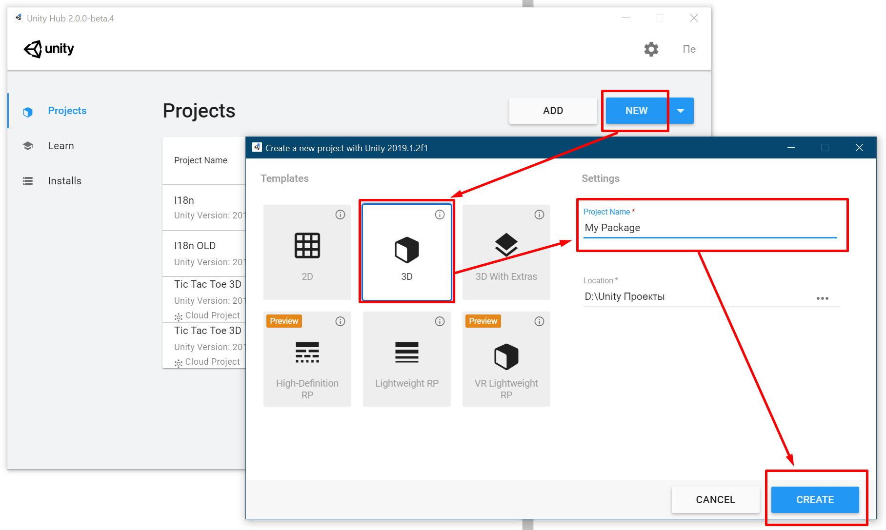
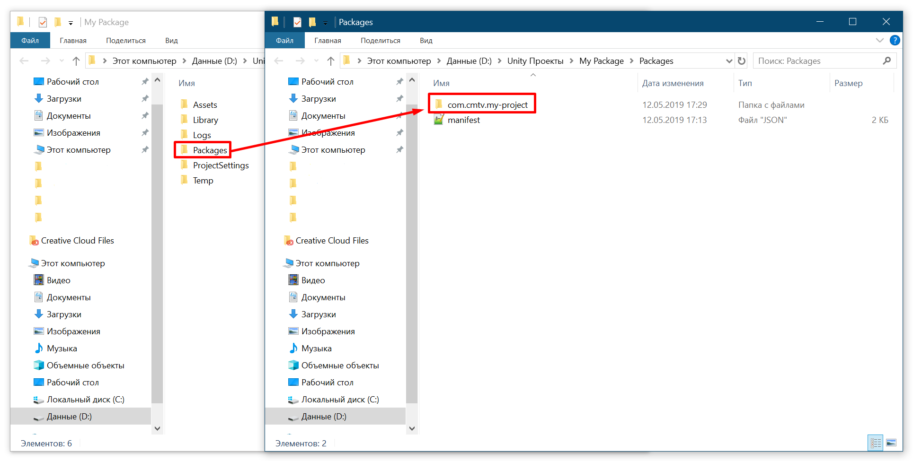
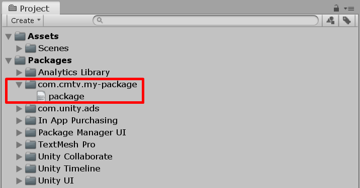
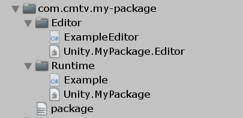

# Создание пакета

В этой статье описаны базовые шаги, которые необходимо выполнить для создания собственного пакета. Подробности, а также дополнительный материал можно найти в других статьях этого раздела.

## Пустой проект

Запустите Unity Hub и создайте обычный пустой проект

[](images/creating-empty-project.png)

## Папка пакета

Зайдите в папку `Packages` в корне созданного проекта и создайте там папку с техническим названием вашего пакета. [Подробнее о названиях пакета](../naming/index.md). Пример: `com.cmtv.my-project`

[](images/creating-package-folder.png)

## `package.json`

Создайте файл `package.json` и укажите два обязательных поля: `name` и `version`

```json
{
    "name": "com.cmtv.my-package",
    "version": "1.0.0"
}
```

Можете указать и другую информацию. [Подробнее о файле `package.json`](../package.json/index.md).

## Обнаружение пакета

Запустите созданный проект в редакторе Unity. Затем в верхнем меню выберите "Assets > Reimport All". Это действите перезапустит Unity.

Когда редактор откроется во второй раз, в окне "Project" раскройте список "Packages". Если вы все сделали правильно, то увидите название своего пакета. Если что-то пошло не так, то в консоле будет отображаться ошибка с необходимыми пояснениями.

[{: .w6 }](images/package-found.png)

С этого момента все действия с пакетом можно выполнять внутри Unity: создавать папки, скрипты, материалы и так далее.

## Сборки

Если вы планируете хранить любые скрипты в пакете, вам нужно создать файлы сборок. Без них Unity не будет распознавать файлы вашего пакета.

Для хранения обычных скриптов создайте папку `Runtime` внутри пакета. В ней через "ПКМ > Create > Assembly Definition" создайте сборку со следующим названием: `Unity.ИМЯ_ПАКЕТА`. Пример: `Unity.MyPackage`.

Если вы планируете создавать скрипты для самого редактора Unity, создайте папку `Editor`, а внутри нее сборку со следующим названием: `Unity.ИМЯ_ПАКЕТА.Editor`. Пример: `Unity.MyPackage.Editor`. Выделите созданную `Editor` сборку внутри редактора Unity и в поле "Platforms" уберите галочку с пункта "Any platform" и оставьте отмеченным только "Editor".

[](images/package-assemblies.png)

## Наполнение пакета

Теперь можете наполнять свой пакет любым содержимым. Основное правило: располагайте все файлы пакета во внутренних папках. Не занимайте корень пакета! Он должен содержать только файл `package.json` и некоторые другие.

Можете подсмотреть организацию файлов у официальных пакетов Unity (просто раскройте их в списке) или же почитать отдельную статью об [оптимальной структуре пакета](../package-layout/index.md).

## Распространение

Когда первая версия пакета готова, вы можете поделиться им с другими людьми.

Например, выложить пакет в отдельный GitHub репозиторий или распрастронять через архив.