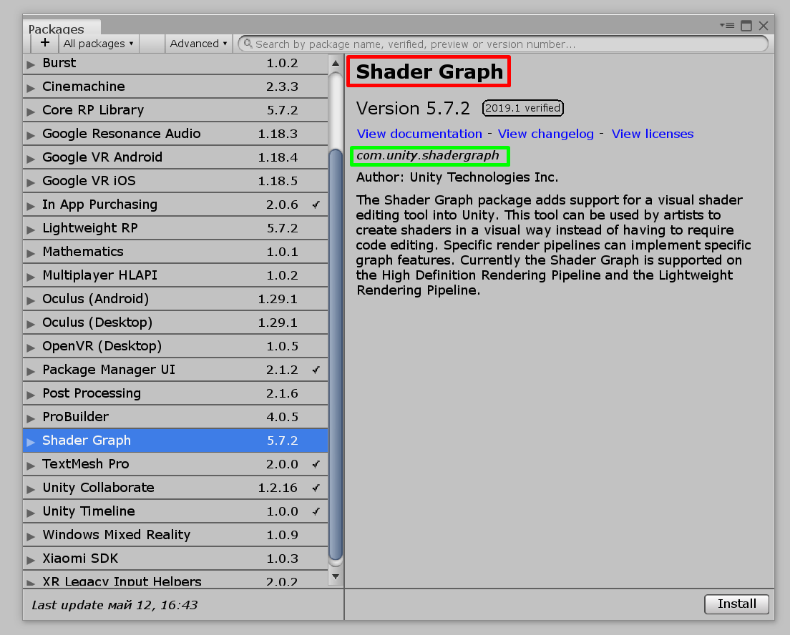

description: Разница между техническим и публичным именем пакета. Объяснение ограничений на техническое имя.

# Название пакета

У любого пакета Unity есть два названия:

* Техническое, которым пользуются Unity и другие программы. Оно должно быть уникально среди используемых пакетов
* Публичное имя, которое показывается людям. Оно может совпадать с именами других пакетов

[{: .w7 .border }](images/two-names.png)

На изображении выше, публичное имя выделено красным прямоугольником, а техническое — зеленым.

Никаких ограничений на публичное имя нет. Можно использовать любые символы. Важно лишь выбрать такое имя, которое коротко и понятно описывает суть пакета.

## Ограничения на техническое имя

На техническое имя действует ряд **обязательных** ограничений:

* Оно всегда должно начинаться с `com.`. После `com.` можно указать название своей компании/ваш никнейм, и, через еще одну точку, указать название пакета. Пример: `com.dima1999.test-package`
* Уложитесь в 50 символов в названии, если хотите, чтобы оно показывалось в интерфейсе. А вообще максимальная длина: 214 символов
* Название может содержать только буквы латинского алфавита в нижнем регистре, дефисы `-`, нижние подчеркивания `_` и точки `.`