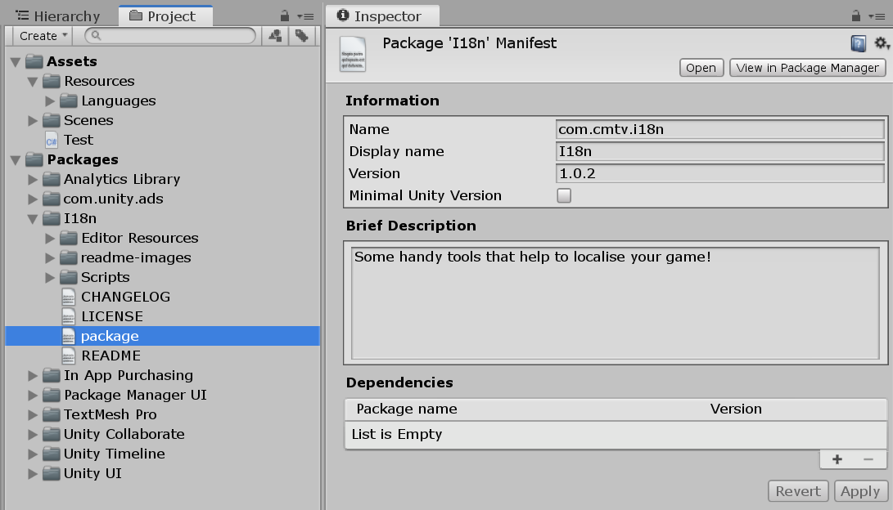

# Манифест пакета

Unity нужно как-то получать информацию о пакете: его название, версию, описание и т.д. Получает он эту информацию из специального файла формата JSON, который называется `package.json`. Он всегда должен находиться в корне пакета.

Данные о пакете можно указать из Unity, выделив `package.json` в окне "Project".

[{ .w8 .border }](images/package-inspector.png)

Но можно указать информацию прямо внутри этого файла в виде атрибутов. Всего есть три вида атрибутов:

* Обязательные
* Важные
* Вспомогательные

## Обязательные атрибуты

Эти поля обязательно должны присуствовать в манифесте. В противном случае менеджер пакетов Unity не сможет его обработать.

### `name`

Уникальный идентификатор (ID) пакета. На этот атрибут наложены следущие ограничения:

* Должен начинаться с `com.НАЗВАНИЕ_КОМПАНИИ.`
* Длина в 50 символов или меньше для отображения в редакторе (макс. 214 символов)
* Может содержать только латинские буквы в нижем регистре, цифры, дефисы, нижние подчеркивания и точки

### `version`

Версия пакета в формате `MAJOR.MINOR.PATCH` с соответствием стандарту [семантического версионирования](https://semver.org/lang/ru/). Ниже даны короткие пояснения к всем трем частям версии:

* `MAJOR` — серьезные изменения с возможной потерей обратной совместимости. Например переход с версии **1**.2.3 на **2**.0.0.
* `MINOR` — новый функционал с сохранением обратной совместимости. Например, переход с 1.**2**.3 на 1.**5**.2.
* `PATCH` — исправления багов. Переход с 1.2.**3** на 1.2.**4**

Например, вы переписали 50% пакета с нуля и добавили тонну новых фич. Так и хочется назвать его "Мой_Пакет 2.0", правда? И это правильно. Это новая ступень для пакета, большой шаг вперед.

Теперь представим, что вы просто добавили несколько интересных фич в пакет, особо ничего не меняя. Неискушенный пользователь про новый функционал может и не догадывается. Революции нет, а значит меняем не первое число в версии (`MAJOR`), а второе (`MINOR`).

Наконец, вы исправили бесячий баг. Ничего нового вы не сделали, лишь починили то, что уже должно было работать. Хвастаться нечем, поэтому меняем только последнее число. Просто патч.

## Важные атрибуты

Эти атрибуты технически не являются обязательными и менеджер пакетов Unity спокойно установит пакет и без них. Но все же заполнить их очень важно, так как он сделают пакет более "дружелюбным" к пользователю.

### `displayName`

Обычное название пакета, которое будет отображаться пользователям в редакторе Unity. Примеры: Unity Timeline, ProBuilder, In App Purchasing.

### `description`

Сжатое описание проекта. Оно будет показываться в окне менеджера пакетов Unity. Можно использовать любые UTF-8 символы, в том числе различные символьные коды, например, переносы строк (`\n`) или точки списка (`\u25AA`).

### `unity`

Минимальная версия Unity, с которой совместим данный пакет. Если атрибут не указан, будет считаться, что он совместим с любой Unity версией.

Формат: `<MAJOR>.<MINOR>` (например, `2018.3`). Для указания конкретного патча используйте атрибут `unityRelease`.

Несовместимые пакеты не будут отображаться в менеджере пакетов Unity.

## Необязательные атрибуты

Из названия ясно, что для работы пакета эти атрибуты не нужны. Но иногда они могут оказаться полезными.

### `unityRelease`

В этом атрибуте можно указать конкретный релиз Unity, с которым совместим пакет, включая альфа и бета версии. Требуемый формат: `<UPDATE><RELEASE>` (например, `0b4`).

Аттрибут будет проигнорирован, если не указан атрибут `unity`.

### `dependecies`

Список ("ключ - значение") пакетов, которые необходимы для работы вашего пакета. Ключи — названия пакетов, а значения — версии.

### `keywords`

Список из ключевых слов, которые характеризуют пакет и его тематику.

### `author`

Описание автора пакета. Формат — объект с полями `name`, `email` и `url`. Пример:

```json
{
    "name": "CMTV",
    "email": "ounity@example.com",
    "url": "https://www.book.ounity.com"
}
```

## Пример манифеста

```json
{
    "name": "com.cmtv.test-package",
    "version": "1.2.3",
    "displayName": "Package Example",
    "description": "This is an example package",
    "unity": "2019.1",
    "unityRelease": "0b5",
    "keywords": 
    [
        "keyword1",
        "keyword2",
        "keyword3"
    ],
    "author": 
    {
        "name": "CMTV",
        "email": "ounity@example.com",
        "url": "https://www.book.ounity.com"
    }
}
```