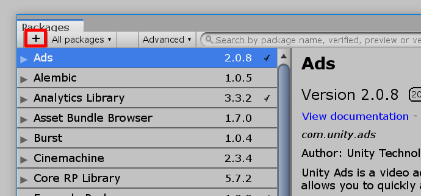

# Распространение пакета

Создать пакет — полдела. Самое главное — использовать его в других своих проектах или поделиться с сообществом.
Для этого нужно уметь **распространять** пакет.

## В виде архива

Самый банальный способ. Просто поместите папку с пакетом в архив и перешлите друзьям/выложите на форуме/файлообменнике.

Пользователь должен скачать этот архив и распаковать в любую удобную папку. После этого, внутри Unity достаточно открыть окно Package Manager ("Window > Package Manager"), кликнуть на плюсик в левом верхнем углу и выбрать пункт "Add package from disk...":

[{: .w7 }](images/installing-locally.png)

Откроется окно выбора файла. Укажите в нем файл `package.json` из распакованного пакета. После Unity автоматически просканирует файлы пакета. С этого момента пакет будет отображаться в Unity и им можно пользоваться.

!!! важно
    Редактор Unity не создает копию пакета. Если вы удалите папку с распакованным пакетом, то он пропадет и из редактора!

## GitHub и прочие git-системы

*Будут описываться действия для GitHub. Отличия должны быть только в ссылке (о ней ниже).*

Создайте репозиторий и добавьте в него все файлы пакета.

Для загрузки пакета пользователю нужно установить себе на компьютер [Git](https://git-scm.com/download/).

После установки Git, перейдите в корень проекта Unity, для которого хотите установить пакет и откройте папку `Packages`. В ней найдите и откройте с помощью любого текстового редактора файл `manifest.json`. Блокнот тоже подойдет.

Добавьте новый элемент вверху списка `dependencies`:

```json hl_lines="3"
{
  "dependencies": {
    "com.company.package-name": "https://github.com/USERNAME/REPOSITORY_NAME.git",
    ...
  }
}
```

* `com.company.package-name` — [техническое имя](../naming/index.md) устанавливаемого пакета
* `https://github.com/USERNAME/REPOSITORY_NAME.git` — обычная ссылка на репозиторий с добавлением `.git` в конце

Ссылка приведена для GitHub репозитория. Для других git-систем она будет выглядеть иначе. Не забудьте поменять `USERNAME` на ваш GitHub никнейм, а `REPOSITORY_NAME` на название пакета.

### Обновление пакета

Unity пока не умеет проверять наличие новых версий пакета. Поэтому обновлять пакет нужно вручную. Есть два способа.

Cамый простой — удалить строчки о вашем пакете в разделе `lock` файла `manifest.json` (он находится в самом низу):

```json hl_lines="3 4 5 6"
...
  "lock": {
    "com.cmtv.test-package": {
      "hash": "64afe9840910a47993b03704bd9885441044a748",
      "revision": "HEAD"
    }
  }
}
```

После удаление Unity автоматически перезагрузит все файлы пакета.

Второй способ — указывать ссылку на репозиторий вместе с пометкой о коммите/ветке/теге. Об этом ниже.

### Указание коммита, ветки и тега

С помощью знака `#` после `.git` в ссылке на пакет можно указать название ветки, тега или идентификатор коммита. Пример:

```
https://github.com/USERNAME/REPOSITORY_NAME.git#beta
```

Будет загружен пакет с ветки `beta`.

```
https://github.com/USERNAME/REPOSITORY_NAME.git#ce97e3b880d947dd3c52beedf7c87ee990b6f32d
```

Будет загружены файлы пакета на момент коммита с указанным ID.

Можно создавать различные ветки или теги под версии пакета, а затем указывать их в ссылке:

```
https://github.com/USERNAME/REPOSITORY_NAME.git#1.0.2
```

Тогда для обновления пакета достаточно будет изменить версию в конце ссылки на требуемую.