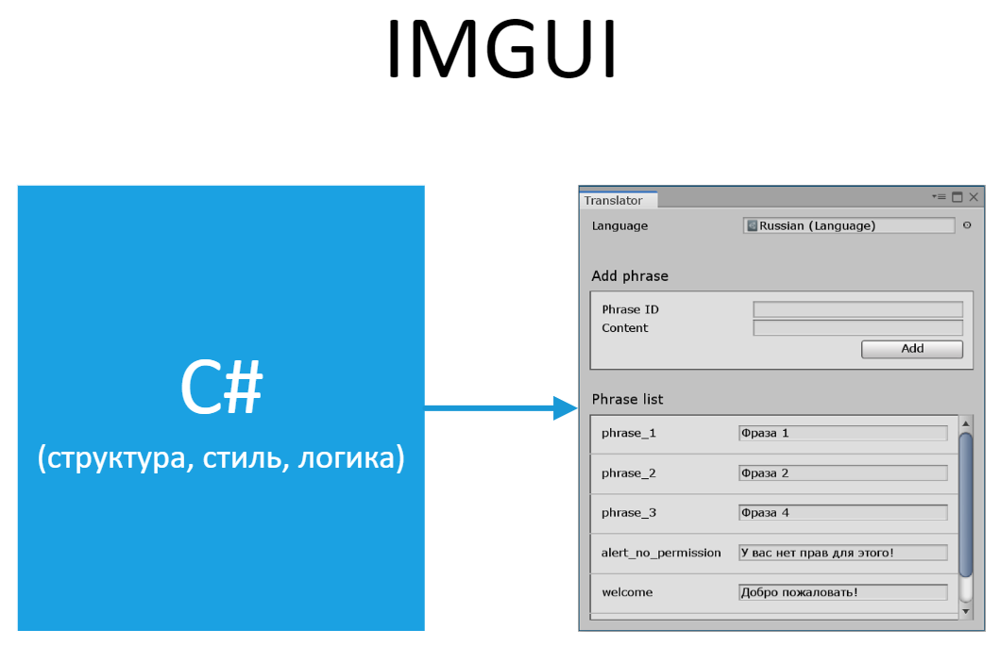
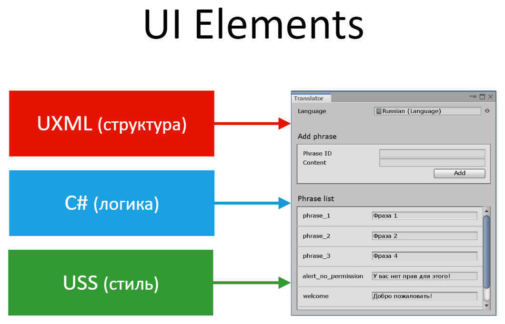

description: Краткое описание UI Elements: что это такое, чем отличается от IMGUI, а также набор полезных ссылок с примерами.

# О UI Elements

Начиная с версии 2019.1 Unity официально вводит новый подход к созданию элементов интерфейса — UI Elements.

Пока что эту технологию можно применять только для самого редактора Unity (окна, инспекторы и т.д.). В будущих релизах обещают дать возможность
использовать UI Elements и внутри игры.

## Прошлое — IMGUI

Раньше весь интерфейс отрисовывался в C# классе окна/инспектора с помощью методов `OnGUI()` и `OnInspectorGUI()`. Такой способ называется IMGUI. В коде также указывалось, как элементы должны выглядеть и как они должны реагировать на различные события (клик, наведение мышкой и так далее).

Основной минус IMGUI — с его помощью очень трудно делать сложные интерактивные интерфейсы. Класс, ответственный за отрисовку, быстро раздувается до неприличных размеров.

[{: style="width: 80%" }](images/imgui-structure.png)

## UI Elements

UI Elements предлагает совершенно другой подход, позаимствованный из веб-программирования.

Любое окно делится на 3 части:

1. **Структура** — древо элеметов, из которых состоит окно
2. **Стиль** — как именно элементы должны выглядеть
3. **Логика** — как элементы реагируют на события

[{: style="width: 80%" }](images/uielements-structure.png)

### Структура

Окно представляет собой древо элементов. Его можно создавать как напрямую в коде, так и в отдельных XML файлах с расширением `.uxml`.

### Стиль

В IMGUI каждый элемент может иметь (или не иметь) свои собственные стилевые свойства. Что-то можно раскрасить, что-то нельзя.

В UI Elements любой элемент поддерживает фиксированный набор свойств. Например:

* Отступы
* Граница
* Цвет
* Фон
* ...

Стили можно задавать как в коде, так и хранить их в файлах с расширением `.uss`.

### Логика

С помощью специальных методов можно искать в древе нужные элементы и прописывать для них логику.

### Гибкость

Никто не заставляет вас разделять интерфейс по разным файлам. И структуру, и стили можно спокойно прописывать в классе окна. Можно комбинировать два подхода.

Например, основная (неизменная) структура окна вынесена в отдельный файл. А динамические элементы (например, элементы списка) могут
добавляться "на ходу" через код в классе окна.

## Для веб-программистов

Если вы когда-нибудь занимались созданием сайтов, то суть UI Elements сводится к следующему:

* Окно = сайт
* HTML → UXML
* CSS → USS
* JS → C#
* jQuery → C# (методы UQuery)

~~Ждем появления UReact, USCSS и так далее.~~

## Полезные ссылки

* [Новость в официальном блоге](https://blogs.unity3d.com/ru/2019/04/23/whats-new-with-uielements-in-2019-1/)
* [Раздел в документации](https://docs.unity3d.com/2019.1/Documentation/Manual/UIElements.html)
* [Много полезных примеров элементов](https://github.com/Unity-Technologies/UIElementsExamples)
* [Пример использования (Турели)](https://github.com/Unity-Technologies/UIElementsUniteLATurretDemo)