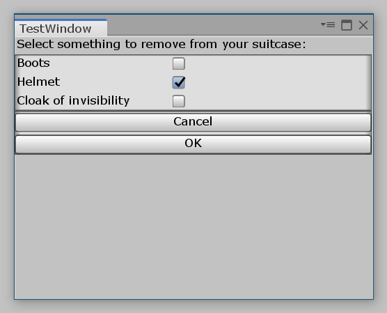

# UXML

UXML — формат файлов, в которых можно описывать структуру интерфейса.

Зачем он нужен, если структуру можно задать прямо в коде? Причина простая: мы разделяем логику (уменьшаем размер класса) от структуры. В проекте становится проще ориентироваться.

## Немного о XML

Как несложно догадаться из названия UXML, структура в этих файлах описывается на языке [XML](https://ru.wikipedia.org/wiki/XML).

Поговорим немного о самом XML. В этом разделе я привожу лишь самую базовую информацию. Множество подробных уроков можно найти в интернете.

XML расшифровывается как e**X**tensible **M**arkup **L**anguage (расширяемый язык разметки). Его придумали, чтобы размечать информацию так, чтобы ее понимани как компьютеры, так и человек.

В XML это достигается с помощью **тегов** и **атрибутов**. Почему в названии XML есть слово "расширяемый"? Потому что теги и атрибуты вы придумываете сами!

### Тег

Тег использутеся для разметки информации. Например, если "Грань будущего" — название фильма, то мы можем обернуть его в тег `<title>`:

```xml
<title>Грань будущего</title>
```

Видно, что есть открывающий тег `<title>` и закрывающий `</title>` с косой чертой перед названием тега.

Иногда применяются **пустые** теги. Их используют, когда само наличие тега несет информацию. Например тег горизонтальной полосы. Сам факт его наличия уже несет информацию. Он ничего не обрамляет.

```xml
<hr />
```

Согласитель, было бы глупо писать `<hr></hr>`.

### Атрибут

Атрибуты нужны, чтобы указать дополнительную информацию для тега. Например, у нас есть тег `<rating>`, с помощью которого указывается оценка фильма:

```xml
<rating>9.0</rating>
```

Но есть проблема. У одного фильма может быть много разных оценок от разных изданий. Поэтому в теге `<rating>` нужно как-то указать издание. Это можно сделать с помощью атрибута `reviewer`:

```xml
<rating reviewer="Kinopoisk">8.0</rating>
<rating reviewer="IMDb">7.9</rating>
```

### Полный пример

Предположим, вы создаете базу всех кинофильмов. У каждого фильма есть название, слоган, описание и оценки разных изданий. Тогда вы можете хранить данные о фильмах в файлах с форматом `fxml` (Film XML). Пример такого файла для фильма "Грань будущего":

```xml
<?xml version="1.0" ?>
<film>
    <!-- Название фильма -->
    <title>Грань будущего</title>

    <!-- Слоган -->
    <slogan>Живи. Умри. И снова</slogan>

    <!-- Описание -->
    <description>
        В недалёком будущем раса инопланетян вторгается на Землю.
        Никакая армия в мире не может противостоять им.
        ...
    </description>

    <!-- Оценки -->
    <ratings>
        <!-- Оценка "Кинопоиска" -->
        <rating reviewer="kinopoisk">8.0</rating>

        <!-- Оценка "IMDb" -->
        <rating reviewer="IMDb">7.9</rating>
    </ratings>
</film>
```

## UXML файл

Минимальный `uxml` файл должен выглядеть так:

```xml
<UXML xmlns="UnityEngine.UIElements">
    <!-- Элементы интерфейса -->
</UXML>
```

Тег с версией XML писать не обязательно.

Что за атрибут `xmlns`? Расшифровывается как "XML Namespace" (пространстро имен XML). Он нужен для того, чтобы Unity знал, где искать классы элементов. Этим атрибутом мы говорим, чтобы Unity по умолчанию пытался найти элементы в пространстве имен `UnityEngine.UIElements`. Оно содержит много привычных элементов, например: кнопки, текстовые поля, переключатели и так далее.

Дальше файл нужно заполнять элементами. Список доступных элементов приведен в разделе "[Библиотека элементов](#библиотека-элементов)".

### Пример разметки

```xml
<UXML xmlns="UnityEngine.UIElements">
    <Label text="Select something to remove from your suitcase:"/>
    <Box>
        <Toggle name="boots" label="Boots" value="false" />
        <Toggle name="helmet" label="Helmet" value="false" />
        <Toggle name="cloak" label="Cloak of invisibility" value="false"/>
    </Box>
    <Box>
        <Button name="cancel" text="Cancel" />
        <Button name="ok" text="OK" />
    </Box>
</UXML>
```

{: .border }

## Использование UXML файла

UXML файл сам по себе бесполезен. Его нужно загрузить в коде. Сделать это можно двумя способами:

```csharp
var template = EditorGUIUtility.Load("path/to/find.uxml") as VisualTreeAsset;
```

Или

```csharp
var template = AssetDatabase.LoadAssetAtPath<VisualTreeAsset>("path/to/find.uxml");
```

Переменная `template` содержит древо элементов, загруженное из указанного `uxml` файла. Это древо можно копировать куда-нибудь с помощью метода `CloneTree()`.

Способов скопировать тоже два.

Можно вызвать метод `CloneTree(...)` с параметром. В этом случае все древо будет скопировано внутрь этого элемента. Таким образом можно скопировать древо, например, в корневой элемент окна.

```csharp
template.CloneTree(root);
```

Другой способ: вызвов метода `CloneTree()` без аргументов возвращает элемент `TemplateContainer`, который содержит все загруженное древо. Этот элемент можно куда-нибудь добавить позже.

```csharp
var ui = template.CloneTree();
```

Пусть у нас есть файл `Assets/TestWindow.uxml`, который содержит разметку из раздела "[Пример разметки](#пример-разметки)".

В классе окна `Assets/TestWindow.cs` используем следующий код:

```csharp
using UnityEngine;
using UnityEditor;
using UnityEngine.UIElements;

public class TestWindow : EditorWindow 
{
    [MenuItem("Window/TestWindow")]
    private static void ShowWindow() 
    {
        var window = GetWindow<TestWindow>();
        window.titleContent = new GUIContent("TestWindow");
        window.Show();
    }

    private void OnEnable() 
    {
         // Загружаем древо элементов
        var uiAsset = AssetDatabase.LoadAssetAtPath<VisualTreeAsset>("Assets/TestWindow.uxml");

        // Копирует древо элементов в корневой элемент окна
        uiAsset.CloneTree(rootVisualElement);
    }
}
```

## Базовые атрибуты

Все элементы интерфейса наследуют от класса `VisualElement`. Этот класс определяет ряд атрибутов, которые доступны всегда:

* `name` — идентификатор элемента. Должен быть уникальным
* `class` — список классов элемента, разделенные пробелами

Оба этих атрибута можно использовать для стилизации. Более того, именно через идентификатор и классы происходит поиск нужных элементов древа в коде класса (UQuery).

* `picking-mode` — `Position`: учитывать клики мышкой или `Ignore`: не учитывать
* `tabindex` — целое число, которое указывает, каким по счету элемент будет выбран при нажатии на клавишу Tab
* `focusable` — может ли элемент принимать фокус
* `tooltip` — текст, который отображатся при наведении курсора на элемент
* `view-data-key` — текстовый ключ, использующийся для сериализации элемента

## Шаблоны

Есть возможность загрузить один UXML файл в другой.

Пусть у нас есть файл `Assets/temp.uxml`:

```xml
<UXML ...>
    <Button ... />
    <Button ... />
    <TextField ... />
</UXML>
```

Как включить этот файл в другой?

Сначала нужно использовать тег `Template` с указанием пути к включаемому файлу. Затем его можно включить с помощью тега `Instance`:

```xml
<UXML ...>
    <!-- Загружаем файл (но не вставляем) -->
    <Template path="Assets/temp.uxml" name="Temp">

    <!-- Вставляем -->
    <Instance template="Temp" name="inst_1">
    <Instance template="Temp">
</UXML>
```

## Сторонние элементы

В сложных интерфейсах часто создаются собственные элементы интерфейса (наследники класса `VisualElement`). Очевидно, что они находятся за пределами пространства имен `UnityEngine.UIElements`, которое содержит только стандартные элементы. 

Например, у вас может быть свой элемент `WebViewer` для отображения сайтов, который находится в пространстве имен `MyGame.UI.UIElements`.

Для того, чтобы использовать `WebViewer` в UXML файле, нужно в нем подключить ваше пространство имен.

```xml
<UXML xmlns="UnityEngine.UIElements" xmlns:mygame="MyGame.UI.UIElements">
    <mygame:WebViewer url="https://book.ounity.ru" />
</UXML>
```

В коде выше мы подключили пространство имен `MyGame.UI.UIElements` и установили для него префикс `mygame`. Все элементы из этого пространства имен теперь можно использовать в UXML файле, поставив перед их названием префикс `mygame:`. Например: `<mygame:WebViewer ...>`.

### Элементы редактора Unity

При разработке разного рода окон для самого редактора Unity очень полезно подключить пространство имен элементов интерфейса редактора: `UnityEditor.UIElements`. В нем содержится много полезных элементов, например: выбор цвета, тулбар и т.д.

```xml
<UXML xmlns="UnityEngine.UIElements" xmlns:uie="UnityEditor.UIElements">
    <!-- Элемент "Кнопка" из библиотеки UnityEngine -->
    <Button />

    <!-- Элемент "Выбор цвета" из библиотеки UnityEditor -->
    <uie:ColorField />
</UXML>
```

## Библиотека элементов

В Unity уже есть две готовых библиотеки элементов. Первая находится в пространстве имен `UnityEngine.UIElements`. Она содержит самые распостраненные элементы: кнопки, текстовые поля, переключатели... Ее мы подключаем к UXML файлам по умолчанию.

Вторая использует пространство имен `UnityEditor.UIElements` и содержит элементы, которые часто используются в окнах редактора Unity: выбор цвета, тулбары... Ее нужно отдельно подключать к UXML файлу (см. раздел "[Сторонние элементы](#сторонние-элементы)").

### Элементы UnityEngine

### Элементы UnityEditor